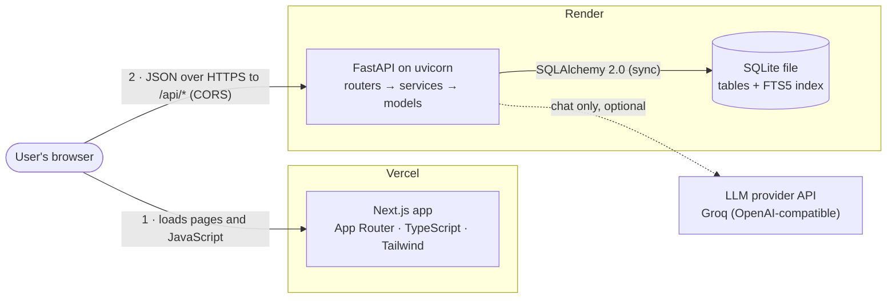
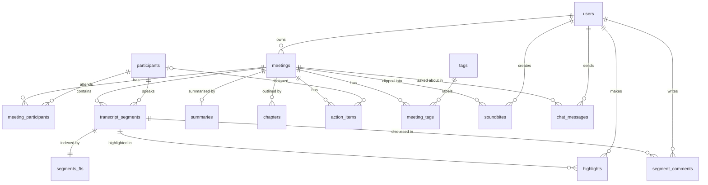

# Glowworm

[](https://github.com/Ritvik2209/fireflies-clone/actions/workflows/ci.yml)

A clone of the Fireflies.ai meeting assistant, built as an SDE Fullstack take-home. It has:
- a library of past meetings;
- a transcript synced with a simulated media player;
- AI-style notes;
- full create, edit and delete.

On top of that come all six bonus features, three extras (CI, speaker analytics, background processing), a responsive layout and an optional intro tour.

- **Live app:** [glowworm-plum.vercel.app](https://glowworm-plum.vercel.app). New here? Click the compass button in the top bar for a two-minute tour.
- **API docs:** [glowworm-api.onrender.com/docs](https://glowworm-api.onrender.com/docs) (Swagger UI).
- **Design document:** [docs/ARCHITECTURE.md](docs/ARCHITECTURE.md). It has the full schema with every constraint, the API reference and step-by-step data flows.

> The API runs on Render's free tier, which sleeps when idle. The first request after a quiet spell can take up to a minute; the app shows a "waking up the server" note while it waits. A restart also resets the database to the six demo meetings.

## Features

### Core
- **Meetings library** (`/meetings`):
  - meetings grouped by day, each with its title, date, time, duration, participant avatars and tags;
  - search by title from the top bar; filter by participant, tag and date range; sort newest or oldest first;
  - filters live in the URL, so a filtered view survives a reload and can be shared;
  - loading skeletons, empty and no-results states, and a clear error with "Try again".
- **Meeting page** (`/meetings/{id}`):
  - **Transcript:** speaker avatars, names and clickable timestamps.
  - **Simulated player:** play/pause, seek bar, current and total time, speed (1× / 1.5× / 2× / 0.5×), skip ±15 s. There's no audio; it's an accurate clock.
  - **Two-way sync:** clicking a line, a chapter or an action item's time seeks. While playing, the current line is highlighted and kept in view. Scrolling by hand pauses that until you press "Sync with player".
  - **Transcript search:** highlights every match, shows "n of m", with previous/next (also Enter and Shift+Enter).
- **AI notes:**
  - overview, keywords, chapters with time ranges (click to seek), and action items grouped by assignee;
  - the demo meetings have hand-written notes; new meetings get notes from a rule-based generator (below).
- **Create, edit, delete:**
  - **New meeting:** a title, a date and time, and participants, plus a transcript uploaded as a `.txt`, `.vtt` or `.json` file (picked or dragged in) or pasted.
  - **Edit and delete:** edit a meeting's title, participants and tags. Delete asks for confirmation first.
  - **Action items:** add them, edit the text and assignee, mark them complete, delete them.
  - **Feedback:** every change is saved in SQLite and confirmed with a toast; failures show the server's error message.
- **Fireflies-style shell:**
  - a slim icon rail that opens into the full sidebar;
  - a top bar with search, New meeting, dark mode, the tour, settings and profile;
  - "Coming soon" pages for Record, Integrations, Team and Settings.

### Bonus features (all six)
- **Dark mode:** a top-bar toggle that follows the system setting until you pick a theme, and remembers your choice.
- **Tags:** coloured tags on meetings, managed in the Edit dialog; filter the library by tag.
- **Export:** the transcript or the summary as TXT, Markdown or PDF, from the player bar's download button.
- **Global search:** full-text search over every transcript (SQLite FTS5) with highlighted snippets. A result opens the meeting at that moment.
- **Highlights, comments and soundbites:** colour a transcript line, discuss it in a comment thread, or save a titled clip that plays only its range.
- **"Ask about this meeting":** a chat that answers from the transcript (Groq, `openai/gpt-oss-120b`) and cites timestamps you can click. Without an API key, it answers from search instead.

### Extras
- **CI:** GitHub Actions checks the backend and the frontend on every push and pull request (details below).
- **Speaker talk time:** one bar per speaker in their avatar colour, with talk time, words per minute, questions asked and longest monologue, computed from the transcript on every request.
- **Background processing:** a new meeting appears in the library straight away as **Processing**. The backend parses the transcript and writes the notes in a background job. A toast says when it's ready, or the row turns **Failed** with the reason and a Delete button.

### Also
- **Works on phones and tablets:**
  - from 768 px up, the sidebar is an icon rail; on phones, the top bar's menu button opens it;
  - below 1024 px, the meeting page switches between Notes and Transcript with tabs;
  - no page scrolls sideways.
- **Intro tour:**
  - an optional walkthrough of the features above, offered on a first visit to the library and restarted from the compass button;
  - each step dims the page except one feature and says what it does;
  - at one step, you open a demo meeting yourself.

## Tech stack

| Layer | Choice |
|---|---|
| Frontend | Next.js 16 (App Router), TypeScript (strict), Tailwind CSS v4, lucide-react, sonner (toasts), next-themes |
| Backend | Python 3.12, FastAPI, SQLAlchemy 2.0 (sync), Pydantic v2, fpdf2 (PDF export) |
| Database | SQLite (own schema) with FTS5 full-text search |
| AI chat | Groq (`openai/gpt-oss-120b`) through the official `openai` SDK, called from the backend only |
| Hosting | Vercel (frontend) · Render (backend, `render.yaml` Blueprint) |
| Quality | pytest, ruff, ESLint, Prettier; GitHub Actions CI on every push and pull request |

## Architecture overview



- **Layers:**
  - **Routers** handle HTTP only;
  - **services** hold the business rules and commit;
  - **models** are SQLAlchemy;
  - the **transcript parsers** and the **notes generator** are pure functions with no database access;
  - `llm/` is the only code that knows the AI provider's SDK.
- **The browser calls the API directly.** Vercel only serves the frontend, so the API allows the frontend's origin (CORS), and its URL is the public `NEXT_PUBLIC_API_URL`. The AI key exists only on the server.
- **Uploads are processed in the background.** `POST /api/meetings` answers 202 with the meeting as `processing`. A background job parses the transcript and writes everything in one transaction, then marks it `ready`, or `failed` with the reason. The browser polls until it's done.
- **The player is a clock in the browser.** It computes the current time from the start time, so it doesn't drift. A binary search finds the current line; only the lines whose state changes re-render.
- **The data stays consistent:**
  - every query is scoped to the current user;
  - a meeting's children cascade on delete;
  - CHECK constraints guard the allowed values;
  - triggers keep the full-text index in step with the transcript.

## Run it locally

You need Python 3.12 and Node.js 22.

**Backend** (in `backend/`). It serves http://localhost:8000, with docs at `/docs`:

```bash
python -m venv .venv
source .venv/bin/activate          # Windows: .venv\Scripts\Activate.ps1
pip install -r requirements-dev.txt
uvicorn app.main:app --reload
```

On first start it creates `app.db` and seeds six demo meetings. Delete `app.db` to start fresh (needed after a schema change, because tables are created, not migrated).

**Frontend** (in `frontend/`). It serves http://localhost:3000:

```bash
npm install
npm run dev                        # use `npm run dev -- -p 3001` if port 3000 is taken
```

The frontend calls `http://localhost:8000` by default, and the backend's default CORS settings allow ports 3000 and 3001. No `.env` file is needed. Without `LLM_API_KEY`, the chat answers from search.

### Environment variables

| Variable | Where | Default |
|---|---|---|
| `DATABASE_URL` | backend | `sqlite:///./app.db` |
| `CORS_ORIGINS` | backend, comma-separated | `http://localhost:3000,http://localhost:3001` |
| `LLM_PROVIDER`, `LLM_MODEL` | backend (chat) | `groq`, `openai/gpt-oss-120b` |
| `LLM_API_KEY` | backend only, never the frontend (chat) | unset: the chat answers from search |
| `NEXT_PUBLIC_API_URL` | frontend, built into the bundle | `http://localhost:8000` |

## Transcript formats

Sample files for every format are in [`backend/samples/`](backend/samples/). Try uploading `offline-launch-plan.vtt`.

| Format | Shape |
|---|---|
| `.txt` | One utterance per line: `[HH:MM:SS] Speaker Name: text` (or `[MM:SS]`). Without timestamps (`Speaker Name: text`), times are estimated at about 150 words per minute. |
| `.vtt` | Standard WebVTT cues. The speaker comes from `<v Name>` or a `Name:` prefix. |
| `.json` | `[{"speaker": "...", "start": 12.5, "end": 18.0, "text": "..."}]`, with times in seconds. |

Everyone who speaks becomes a participant. A missing title, an unknown format or an empty transcript is rejected at once (HTTP 422). A file that can't be parsed becomes a **Failed** meeting whose message names the line or item number.

## How the notes are generated

The six demo meetings have hand-written notes. New meetings get notes from a rule-based generator (`backend/app/services/summary_generator.py`, no LLM):
- **Overview:** the first few substantial sentences.
- **Keywords:** the most frequent meaningful words, leaving out stopwords and speakers' names.
- **Chapters:** windows of about 5 minutes, each titled by its top terms.
- **Action items:** sentences where someone commits to something ("I'll…", "we will…", "need to", "let's", "follow up", "by Friday"…). Questions and pleasantries are skipped, and the assignee is the speaker.

## API

Every route is under `/api`. The interactive docs at [`/docs`](https://glowworm-api.onrender.com/docs) show each request and response model; the full reference is [ARCHITECTURE.md §7](docs/ARCHITECTURE.md#7-api). Errors are always `{"detail": "..."}`, and validation errors also list each field.

| Area | Endpoints |
|---|---|
| Health | `GET /health`: status, SQLite version, FTS5 support, and whether an AI key is configured (never the key) |
| Meetings | `GET, POST /meetings` (list filters: `q`, `participant_id`, `tag_id`, `date_from`, `date_to`, `sort`) · `GET, PATCH, DELETE /meetings/{id}`. `POST` answers 202: the transcript is processed in the background. |
| Action items | `POST /meetings/{id}/action-items` · `PATCH, DELETE /action-items/{id}` |
| People and tags | `GET /participants` · `GET, POST /tags` · `DELETE /tags/{id}` |
| Export | `GET /meetings/{id}/export?content=transcript\|summary&format=txt\|md\|pdf` |
| Search | `GET /search?q=`: full-text search over every transcript |
| Highlights, comments, soundbites | `PUT, DELETE /segments/{id}/highlight` · `GET, POST /segments/{id}/comments` · `PATCH, DELETE /comments/{id}` · `GET, POST /meetings/{id}/soundbites` · `PATCH, DELETE /soundbites/{id}` |
| Chat | `GET, POST, DELETE /meetings/{id}/chat` (questions up to 500 characters; 10 a minute per meeting) |
| Speaker analytics | `GET /meetings/{id}/analytics` |

Status codes: 200, 201 (created), 202 (create accepted), 204 (deleted), 404, 409 (a conflict, such as a duplicate tag, removing a speaker, or editing a meeting that isn't ready), 422 (invalid input) and 429 (chat rate limit).

## Database

SQLite with foreign keys enforced; SQLAlchemy creates the tables at startup. Columns, constraints, cascades and index decisions are in [ARCHITECTURE.md §6](docs/ARCHITECTURE.md#6-database).

| Table | Holds |
|---|---|
| `users` | The default user (there's no real login). |
| `meetings` | Title, date, duration, source, and `status` (`processing`, `ready` or `failed`) with `error_message`. |
| `participants`, `meeting_participants` | People, shared across meetings. |
| `transcript_segments` | The transcript lines: speaker, start and end in ms, text. `segments_fts` indexes them for search. |
| `summaries`, `chapters`, `action_items` | The AI notes. |
| `tags`, `meeting_tags` | Tags. |
| `highlights`, `segment_comments`, `soundbites` | Annotations. |
| `chat_messages` | The "Ask about this meeting" history. |



**Delete rules:**
- Deleting a meeting removes its transcript (with its highlights and comments), notes, action items, soundbites, chat history and links.
- Participants and tags are shared, so they're never deleted with a meeting.
- A participant who speaks in a transcript can't be deleted.

## Tests and checks

```bash
cd backend && pytest && ruff check . && ruff format --check .            # 91 tests: parsers, notes generator, every API area
cd frontend && npm run lint && npx prettier --check . && npm run build   # the build also type-checks
```

**Continuous integration:** [`.github/workflows/ci.yml`](.github/workflows/ci.yml) runs on every push and pull request to `main`, as two parallel jobs:
- **Backend:** Python 3.12.7 (the same as Render): `ruff check`, `ruff format --check`, `pytest`.
- **Frontend:** Node 22 (from `engines` in `package.json`, which Vercel also uses): `npm ci`, `npm run lint`, `npm run format:check`, `npx next typegen`, `npx tsc --noEmit`, `npm run build`.

No secrets are needed: the chat tests replace the AI with a fake. The badge at the top shows the latest result.

The live app is also checked with scripted headless-browser tests, at desktop, tablet and phone sizes:
- the library's search, filters and sort;
- the player, transcript sync and search;
- creating a meeting from every format;
- edit, action items and delete;
- annotations, export, global search and the chat;
- the intro tour.

## Deployment

1. **Backend (Render):** in the Render dashboard, choose **New → Blueprint** and pick this repository. [`render.yaml`](render.yaml) defines one free web service:
   - root `backend/`, built with `pip install -r requirements.txt` and started with `uvicorn app.main:app --host 0.0.0.0 --port $PORT`;
   - health check `/api/health`, and Python 3.12.7;
   - `CORS_ORIGINS` set to the Vercel address, and the AI provider and model.
2. **AI key (optional):** in the service's **Environment** settings, set `LLM_API_KEY` to a Groq key. The Blueprint declares it without a value, so it's never in the repository.
3. **Frontend (Vercel):** import the repository with root directory `frontend/`, and set `NEXT_PUBLIC_API_URL` to the Render URL, for example `https://glowworm-api.onrender.com`.
4. **Updates:** both redeploy automatically on every push to `main`. CI runs alongside the deploys; it doesn't block them.

## Assumptions and trade-offs

- **No real login.** Everything runs as one default user, Alex Morgan. Every query is scoped to the owner, so real auth would plug in at a single dependency (`get_current_user`).
- **The player is simulated.** There's no audio or speech-to-text; transcripts are uploaded or pasted, as the brief allows.
- **SQLite on Render's free tier is temporary.** The disk is wiped on every restart or redeploy, so the database re-seeds the six demo meetings, and meetings you create don't survive a restart. Production would use a persistent database such as Postgres, with migrations.
- **Uploads are processed in the background inside the API process** (FastAPI `BackgroundTasks`).
  - A restart mid-job loses the job; startup marks such meetings failed.
  - It can't scale across machines.
  - Production would use a job queue (Celery or RQ with Redis) with retries, and push status updates instead of polling.
- **Dates are stored in UTC** and shown in your browser's time zone.
- **Library search matches titles only,** and there's no pagination. Both are fine at this scale; searching inside transcripts is the global search.
- **People are identified by name,** matched case-insensitively. People who speak in a transcript always stay participants of that meeting.
- **The rule-based notes favour recall:** a sentence like "We'll film it in the basement" can become an action item. The demo meetings' notes are hand-written.
- **The chat is limited per meeting** (10 questions a minute) and answers only from that meeting's transcript.

## Project structure

```text
backend/app/      FastAPI app: routers (HTTP) → services (rules) → models (SQLAlchemy);
                  parsers, notes generator, llm/ (AI client and prompt), seed data
backend/tests/    pytest suite (91 tests)
backend/samples/  example transcripts in every supported format
frontend/src/     Next.js app: app/ (routes), components/ (layout, meetings, meeting-detail,
                  tour, ui), hooks/ (player clock, status polling), lib/ (API client, helpers)
docs/             ARCHITECTURE.md: design, schema, API and data flows
render.yaml       Render Blueprint for the backend
.github/          CI workflow (GitHub Actions)
```
