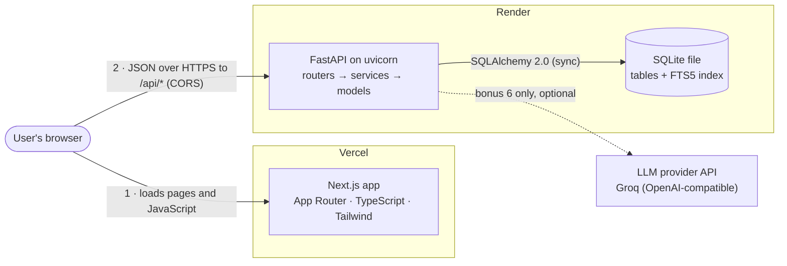
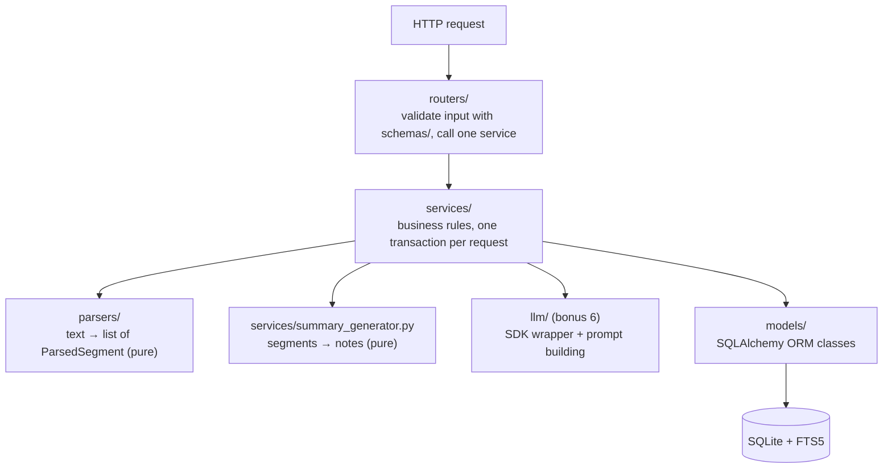
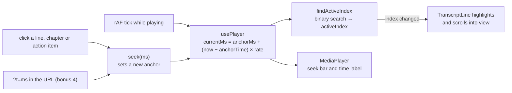
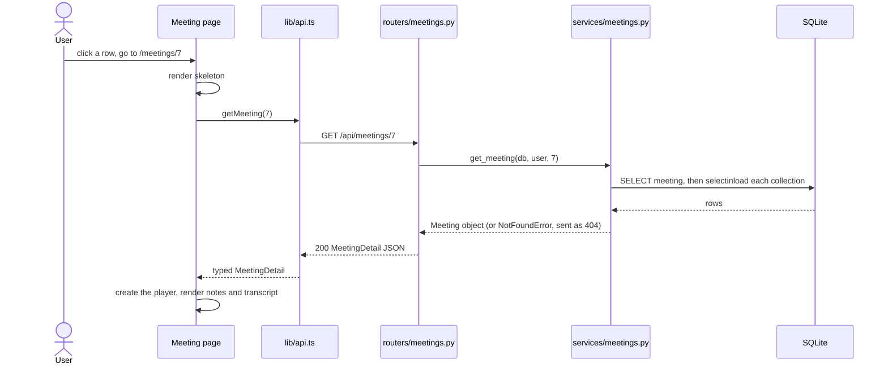
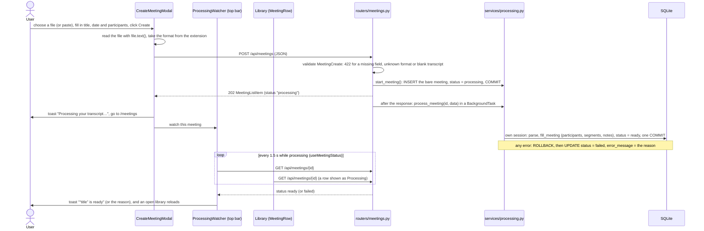
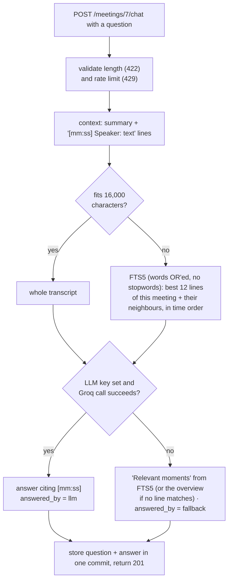
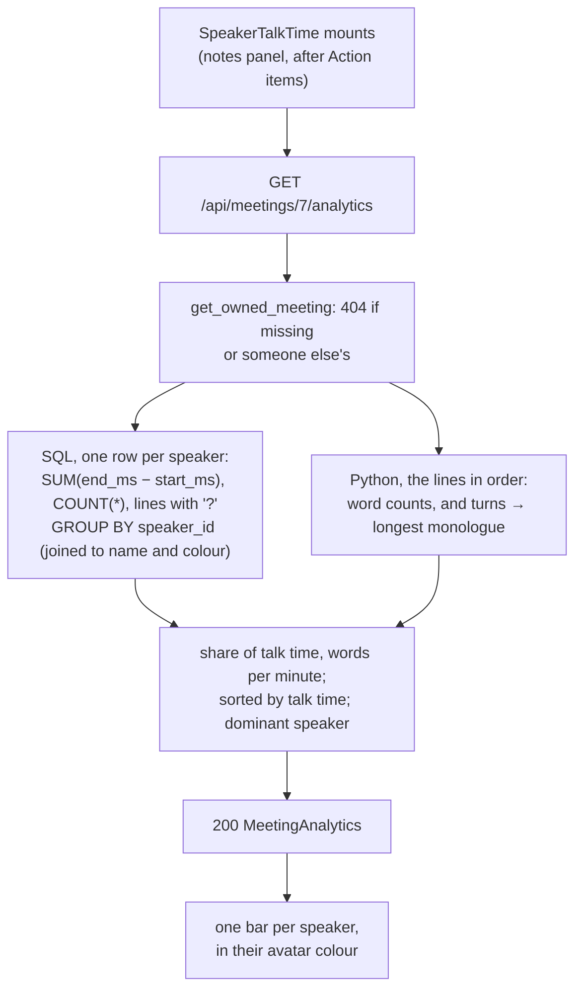
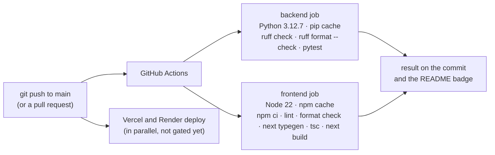

# Architecture

> **Status: updated during the extras (9 Oct).** Every core feature, all six bonuses (§9), CI (§10.1), speaker analytics (§9.7) and background processing for uploads (§8.6, §9.8) are built and deployed. The core:
> - the backend core (database, parsers, summary generator, services, API, seed data, tests);
> - the meetings library;
> - the meeting page (player, transcript sync and search, notes);
> - creating, editing and deleting meetings and action items, with toasts (§8.6–8.8);
> - dark mode (§9.1, built before Phase 5 at the owner's request).
>
> Names below match the code. The Core Gate was verified on the live app in Phase 6 (9 Oct). The six bonus features are summarised in §9, and each bonus phase adds its step-by-step data flow when it is built. Phase 13 regenerates this document from the final code. If the code and this document disagree, the code wins and this document gets fixed.

**Contents:** [1. Overview](#1-system-overview) · [2. Stack](#2-tech-stack) · [3. Repository layout](#3-repository-layout) · [4. Backend](#4-backend) · [5. Frontend](#5-frontend) · [6. Database](#6-database) · [7. API](#7-api) · [8. Core data flows](#8-core-data-flows) · [9. Bonus features](#9-bonus-features) · [10. Deployment](#10-deployment) · [11. Assumptions and trade-offs](#11-assumptions-and-trade-offs)

## 1. System overview

Glowworm recreates the core of Fireflies.ai for meetings that have already happened: a library of meetings, a transcript that stays in sync with a media player, AI-style notes (overview, keywords, chapters, action items), and full create / edit / delete, all persisted in SQLite. Six bonus features build on that core: dark mode, tags, export (TXT / Markdown / PDF), global transcript search, comments / highlights / soundbites, and an "Ask about this meeting" chat backed by an LLM. Real recording, speech-to-text, integrations and authentication are out of scope and appear as placeholders.



- **Vercel only serves the frontend.** Once a page has loaded, the browser calls the API directly. That is why the API needs CORS and why its URL is a public `NEXT_PUBLIC_` variable.
- **Only the API touches the database.** SQLite is a single file on the API server's disk.
- **Only the API talks to the LLM** (bonus 6). The key lives in a Render environment variable and never reaches the browser. Without a key, the chat falls back to search results, so the demo always works.
- **There is no audio.** The player is a virtual clock in the browser (§5.3). The brief allows a placeholder player.

## 2. Tech stack

| Concern | Choice | Why |
|---|---|---|
| UI framework | Next.js 16.4 App Router (Turbopack) + TypeScript (strict) | Fixed by the brief. File-based routes, and one root layout renders the sidebar and top bar for every page. Cache Components is turned off: every page fetches its data in the browser, so the classic App Router model is simpler. |
| Styling | Tailwind CSS | Utility classes make it quick to match Fireflies' spacing and colours; `dark:` variants give dark mode. |
| Small UI libraries | `lucide-react` (icons), `sonner` (toasts), `next-themes` (dark mode) | Single-purpose and approved. Everything else, including modals and form controls, is hand-built. |
| API | FastAPI + Pydantic v2 | Type-hinted request/response models give validation, serialisation and the OpenAPI docs at `/docs` from one definition. Dependency injection supplies the DB session and the current user. |
| ORM | SQLAlchemy 2.1 (the 2.0-style typed API), sync | Explicit, typed models with relationships and cascades. Sync because SQLite is a local file: async would add complexity without a real I/O benefit. |
| Database | SQLite + FTS5 | Zero-ops single file. FTS5 is built into SQLite and gives ranked full-text search without another service. |
| PDF export (bonus 3) | `fpdf2` | Pure Python with no system libraries, so it installs on Render as-is. |
| LLM (bonus 6) | Groq, through the official `openai` SDK (Groq's API is OpenAI-compatible; the owner chose it in Phase 12) | Called only from `backend/app/llm/client.py`, so switching providers touches one module; `LLM_PROVIDER=openai` already works. |
| Quality | pytest + httpx (`TestClient`), ruff; ESLint + Prettier | Tests for the parsers, the summary generator and key endpoints; one linter/formatter per language. |

## 3. Repository layout

```text
/
├── CLAUDE.md              condensed brief and working rules for coding sessions
├── README.md              setup, deploy steps, stack, schema, API, assumptions (Phases 6 and 13)
├── render.yaml            Render Blueprint for the backend (Phase 1)
├── docs/
│   ├── ARCHITECTURE.md    this document
│   └── reference/         Fireflies screenshots used as the UI reference (local only, git-ignored)
├── backend/
│   ├── requirements.txt   runtime Python dependencies (installed on Render)
│   ├── requirements-dev.txt  + pytest, httpx, ruff for local development
│   ├── pyproject.toml     ruff and pytest configuration
│   ├── app/               the FastAPI application (table below)
│   ├── samples/           example .txt / .vtt / .json transcripts for demoing upload
│   └── tests/             pytest suite: parsers, summary generator, key endpoints
└── frontend/              Next.js app (scaffolded with create-next-app in Phase 1)
    └── src/
        ├── app/           routes, one folder per URL (§5.1)
        ├── components/    UI grouped by feature (table below)
        ├── hooks/         reusable stateful logic
        └── lib/           API client, shared types, formatting helpers
```

### Backend: `backend/app/`

| Path | Responsibility |
|---|---|
| `main.py` | Creates the FastAPI app: CORS middleware, routers mounted under `/api`, exception handlers, and a `lifespan` hook that creates the tables (and, from bonus 4, the FTS5 index) and seeds an empty database. |
| `config.py` | Reads settings from environment variables (`DATABASE_URL`, `CORS_ORIGINS`, and the `LLM_*` variables in bonus 6) into a small frozen dataclass, with local defaults. |
| `database.py` | SQLAlchemy engine, `SessionLocal`, the declarative `Base`, the `get_db()` dependency, the `PRAGMA foreign_keys=ON` listener, and (bonus 4) the FTS5 setup SQL. |
| `dependencies.py` | `get_current_user()`: returns the default user. The single place where real authentication would plug in. |
| `errors.py` | Domain exceptions (`NotFoundError` 404, `ConflictError` 409, `InvalidInputError` 422; `RateLimitError` 429 arrives with bonus 6) and the handlers that turn them, and request-validation errors, into JSON error responses. |
| `models/` | One module per table group. Core: `user.py`, `meeting.py`, `participant.py`, `associations.py` (many-to-many link tables), `transcript.py`, `summary.py` (summary + chapters), `action_item.py`. Bonuses: `tag.py`, `annotations.py` (highlights, comments, soundbites), `chat.py`. `types.py` holds `UTCDateTime` (§6.7). Allowed values live next to their table as `Literal` types (`AvatarColor`, `GeneratedBy`) and generate the CHECK constraints. `__init__.py` imports every model so `Base.metadata` knows all tables before `create_all()` runs. |
| `schemas/` | Pydantic request/response models per resource: `MeetingCreate`, `MeetingUpdate`, `MeetingFilters` (the list's query parameters), `MeetingListItem`, `MeetingDetail`, `ActionItemCreate/Update/Out`, `ParticipantOut`, … `base.py` has `ORMModel` (`from_attributes=True`), `ErrorResponse` and the error responses shown in `/docs`. |
| `routers/` | One router per resource. Core: `health`, `meetings`, `action_items`, `participants`. Bonuses: `tags`, `export`, `search`, `annotations`, `chat`. Extras: `analytics`. HTTP concerns only; the shared `DbSession` and `CurrentUser` dependency types come from `dependencies.py`. |
| `services/` | Business logic. Core: `meetings` (list with filters, `get_meeting` for the detail page, `get_owned_meeting` for the bare row, `update_meeting` (409 unless the meeting is ready), `delete_meeting`, `save_meeting` (the seed script's new, ready meeting) and `fill_meeting` (writes a transcript and its notes; shared by the seed script and the upload job)), `participants` (get-or-create by name, colour from the name), `action_items`, `summary_generator` (pure; returns `MeetingNotes`). Bonuses: `tags`, `export`, `search` (FTS5), `annotations`, `chat`. Extras: `analytics` (speaker talk time, computed on read), `processing` (Extra 3: saves an upload as processing and runs its background job). |
| `llm/` | Bonus 6: `client.py` wraps the chosen provider's SDK behind one function; `prompts.py` builds the grounded prompt. Isolated so the provider is swappable. |
| `parsers/` | `base.py` (`ParsedSegment`, `TranscriptParseError`, timestamp helpers), `txt_parser.py`, `vtt_parser.py`, `json_parser.py`, and `dispatcher.py` with `parse_transcript(text, format)`. |
| `fonts/` | DejaVu Sans regular and bold, with their licence, for PDF export (bonus 3; `fpdf2`'s own fonts only cover Latin-1). |
| `seed/` | `seed_data.json` (the default user, the people directory and six hand-written meetings; bonus phases add tags, highlights, comments and soundbites) and `seed.py` (`seed_if_empty()`). See §4.7. |

### Frontend: `frontend/src/`

| Path | Responsibility |
|---|---|
| `app/layout.tsx` | Root layout: fonts, toaster, theme provider (bonus 1), and the app shell (`Sidebar` + `Topbar`) around every page. |
| `app/page.tsx` | Redirects `/` to `/meetings`. |
| `app/meetings/page.tsx` | Library: filters and the meeting list. |
| `app/meetings/[id]/page.tsx` | Meeting page: notes, transcript and player. |
| `app/search/page.tsx` | Global search results (bonus 4): `components/search/SearchResults` inside `<Suspense>`. |
| `app/{record,integrations,team,settings}/page.tsx` | "Coming soon" placeholder pages. |
| `components/layout/` | `Sidebar`, `Topbar`, `TopbarSearch` (the title search, §5.1), `Logo`, `navigation.ts` (the nav links and section titles, shared by both bars), `ThemeToggle` (bonus 1), `AppToaster` (where toasts appear; follows the theme). The top bar's New meeting button opens `CreateMeetingModal`. |
| `components/meetings/` | `MeetingsLibrary` (the library page's state and data loading), `MeetingFilters` (participant, date range, sort, clear), `MeetingList` (day groups, skeleton, empty/no-results/error states), `MeetingRow`, `CreateMeetingModal` (upload or paste a transcript), `EditMeetingModal` (title and participants), `DeleteMeetingDialog`, `ParticipantsInput` (names as chips), `TagPicker` (bonus 2: toggle and create tags in the edit modal). Extra 3: `MeetingRow` shows a Processing badge or a Failed row (reason and Delete); `ProcessingWatcher` (mounted in the top bar) follows a just-created meeting and toasts when it's ready. |
| `components/meeting-detail/` | Core: `MeetingView` (loads the meeting: skeleton, not found, error), `MeetingWorkspace` (owns the player; lays out notes, transcript and player), `MeetingHeader`, `SummaryPanel`, `ChaptersList`, `ActionItemsList`, `TranscriptPanel` (search state, auto-scroll, "Sync with player"), `TranscriptLine`, `TranscriptSearch`, `MediaPlayer`, `ActionItemForm` (add or edit an item). Bonuses: `ExportDialog` (3: the download dialog, opened from the player bar), `HighlightsList`, `CommentThread` (inline under a line), `SoundbitesList`, `SoundbiteDialog` (5), `AskPanel` (6). Extras: `SpeakerTalkTime` (2: the talk-time bars), `UnprocessedMeeting` (3: the Processing or Failed view instead of an empty transcript). |
| `components/ui/` | Reusable primitives: `Button` (and `buttonClasses` for links that look like buttons), `IconButton`, `Modal` (on the native `<dialog>`), `Field` (label and hint), `Input` (and styled native `Select` and `Textarea`), `Badge`, `Avatar`, `AvatarStack` (a row of participant initials), `TagChip` (bonus 2), `EmptyState`, `ComingSoon`, `Skeleton`, `SlowLoadingHint` (the cold-start note). |
| `hooks/` | `usePlayer` (virtual clock; `playRange` for soundbites), `useDebounce`, `useAnnotationActions` (bonus 5: stable save-and-update handlers), `useMeetingStatus` (Extra 3: polls a processing meeting until it's ready or failed). |
| `lib/transcript.ts` | Pure functions: `findActiveIndex` (binary search for the line or chapter playing at a given time), `findMatches` and `groupMatchesByLine` (transcript search). They aren't hooks, because they hold no state. |
| `lib/api.ts` | The only module that calls `fetch`: one typed function per endpoint; throws an `ApiError` carrying the server's `detail` message. |
| `lib/types.ts` | TypeScript types that mirror the API's response models. |
| `lib/format.ts` | Time and date formatting (`ms` → `12:34` or `1:02:03`, dates in the browser's local time) and avatar initials. |
| `lib/cn.ts` | `cn()`: joins conditional class names. |
| `lib/download.ts` | `saveFile(blob, filename)`: saves a fetched file through a temporary object URL (bonus 3). |
| `lib/url.ts` | `replaceSearchParams()`: updates the query string with `history.replaceState` (no navigation; Next.js keeps `useSearchParams` in sync). |
| `lib/currentUser.ts` | The default logged-in user shown in the top bar (matches the seeded user). |
| `lib/events.ts` | Extra 3: `announceMeetingsChanged()` / `onMeetingsChanged()`, a browser event that tells an open library to reload after a create or delete elsewhere. |
| `app/icon.svg` | Our own favicon (the Glowworm mark). |

## 4. Backend

### 4.1 Layers



| Layer | Knows about | Does not know about |
|---|---|---|
| Routers | HTTP: paths, status codes, request/response schemas, dependencies | SQL, business rules |
| Services | Business rules, the DB session, models, domain errors | HTTP (they never raise `HTTPException`) |
| Parsers, summary generator | Plain Python data in and out | The database, HTTP |
| `llm/` | The provider SDK and the prompt format | The database (the chat service hands it plain text) |
| Models | Tables, columns, relationships | Everything above |

Each piece can be read, tested and changed on its own. Services are called by routers, the seed script and tests alike; the pure modules are unit-tested with plain inputs and outputs; tests replace the LLM client with a fake.

### 4.2 Request lifecycle (example: `GET /api/meetings/7`)

1. uvicorn hands the request to FastAPI, which matches the route in `routers/meetings.py` and validates `7` as an `int` (anything else → 422).
2. Dependencies run: `get_db()` opens a SQLAlchemy `Session`; `get_current_user()` returns the default user.
3. The router calls `meetings_service.get_meeting(db, user, 7)`.
4. The service runs one `SELECT` for the meeting, scoped to `owner_id = user.id`, plus one `selectinload` query per collection. If nothing matches it raises `NotFoundError`.
5. The router returns the ORM object, and FastAPI serialises it through the `MeetingDetail` response model (`from_attributes=True`) into JSON.
6. `get_db()` closes the session after the response is sent. Had step 4 raised `NotFoundError`, the handler in `main.py` would have returned `404 {"detail": "Meeting 7 not found"}`.

### 4.3 Configuration

| Variable | Used by | Local default | Production |
|---|---|---|---|
| `DATABASE_URL` | backend | `sqlite:///./app.db` | same; Render's disk is ephemeral (§10) |
| `CORS_ORIGINS` | backend, comma-separated | `http://localhost:3000,http://localhost:3001` | `https://glowworm-plum.vercel.app` (set in `render.yaml`) |
| `LLM_PROVIDER`, `LLM_MODEL`, `LLM_API_KEY` | backend, bonus 6 | unset (chat uses the fallback) | set in Render's dashboard only |
| `NEXT_PUBLIC_API_URL` | frontend, inlined at build time | `http://localhost:8000` | the Render URL |

### 4.4 Startup

FastAPI's `lifespan` hook in `main.py` runs once per process start:

1. `Base.metadata.create_all(engine)` creates any missing tables: the core tables, plus each bonus's tables once its models exist. It never alters existing tables.
2. From bonus 4: raw SQL creates the `segments_fts` virtual table and its three triggers (`IF NOT EXISTS`, so it is safe on every start), then runs FTS5's `rebuild` command so rows that existed before the index are included.
3. If the `users` table is empty, `seed_if_empty()` loads `seed/seed_data.json`: the default user and six meetings with hand-written notes (`generated_by = "seed"`).

When a phase adds tables or seed data, a local database must be deleted (`backend/app.db`) to pick them up; on Render every deploy starts from a fresh disk anyway.

### 4.5 Errors

Every error response has the same shape, so the frontend can always show `detail` in a toast:

```json
{ "detail": "Meeting 42 not found" }
```

| Raised by | Exception | Status |
|---|---|---|
| FastAPI request validation | `RequestValidationError` (the handler adds an `errors` list with field details) | 422 |
| Services | `NotFoundError` | 404 |
| Services | `ConflictError`: duplicate tag name, or removing a participant who speaks in the transcript | 409 |
| Parsers, services | `TranscriptParseError` / `InvalidInputError`, e.g. "Line 4: expected `[HH:MM:SS] Speaker: text`" | 422 |
| Chat service (bonus 6) | `RateLimitError`: too many questions per minute | 429 |

FastAPI's default validation error puts a list in `detail`. Our handler keeps `detail` a readable string (the first problem, ready for a toast) and lists every field under `errors`, with Pydantic's "Value error, " prefix removed:

```json
{ "detail": "title: can't be null", "errors": [{ "field": "title", "message": "can't be null" }] }
```

### 4.6 Parsers and the summary generator

**Parsers** (`parsers/`): each returns `list[ParsedSegment(speaker, start_ms, end_ms, text)]`; errors are `TranscriptParseError` (a 422) naming the line or item.

- **txt:** the first line decides the mode. With timestamps (`[HH:MM:SS]` or `[MM:SS]`), each utterance lasts until the next one starts and the last lasts as long as its words take to say; a `Name: text` line without a timestamp in a timestamped file is an error. Without timestamps, utterances are laid end to end at ~150 words per minute. A line that doesn't start an utterance continues the previous one (wrapped text). A speaker name starts with a letter and is at most 60 characters.
- **vtt:** requires the `WEBVTT` header; skips NOTE, STYLE and REGION blocks; reads the speaker from `<v Name>` or a `Name:` prefix (otherwise "Unknown speaker"); strips other markup; rejects cues that end before they start.
- **json:** each item is validated by a small Pydantic model (`speaker`, `start`, `end` in seconds, `text`; `end ≥ start`); errors read like "Item 2: end: Field required".

**Summary generator** (`services/summary_generator.py`): `generate_notes(segments) → MeetingNotes`, a pure function.

- **Overview:** the first three sentences with at least 8 words and 3 content words (not questions).
- **Keywords:** the 6 most frequent content words. Content words exclude a hand-written stopword list, words shorter than 3 letters, and the speakers' own names, which would otherwise top every meeting.
- **Action items** (at most 8): sentences with a person committing ("I'll", "we will"), "need to", "let's", "follow up", "action item" or "by Friday / tomorrow / end of day…". Questions are excluded, as are pleasantries with fewer than 2 content words ("Let's get started."). The assignee is the speaker, and `source_start_ms` is the segment's start.
- **Chapters:** one per 5-minute window, titled from that window's top 3 terms ("Sprint, offline and sync").

### 4.7 Seed data

`seed/seed_data.json` holds the default user (Alex Morgan), a people directory (name, email, avatar colour) and six original meetings at a fictional field-service software company, Kestrel: sprint planning, a sales discovery call, a design review, a 1:1, an investor update and a customer escalation. Each meeting has a duration, its participants, transcript rows `[speaker, "mm:ss", text]` (each line lasts until the next starts), and hand-written notes with chapters and action items whose `at` times point at the line where they were said.

The dialogue was written by hand, and the start times were computed from each line's word count at a measured pace (95–100 words per minute plus a pause between turns), so every meeting lands within the brief's 15–45 minutes (15.8–17.2). `seed_if_empty()` runs at startup, only when there are no users, and stores every meeting through `save_meeting`, the same code path as an upload. Tests check the brief's seed rules and that every chapter and action item lands on the start of a transcript line.

### 4.8 Testing

pytest, 57 tests: parsers, the summary generator, models (the database really enforces CASCADE, RESTRICT and NOCASE), every API route, the seed rules, and the sample files in `backend/samples/`. `tests/conftest.py` points `DATABASE_URL` at a temporary SQLite file *before* the app is imported, so tests run the real code paths and never touch `app.db`. Each test gets freshly created tables. The `TestClient` isn't used as a context manager, so the startup hook (create tables, seed) doesn't run; tests seed explicitly when they need data.

## 5. Frontend

### 5.1 Routes

| URL | Page | Notes |
|---|---|---|
| `/` | none | Redirects to `/meetings`. |
| `/meetings` | Library | Filters are mirrored in the query string (`?q=&participant=&from=&to=&sort=`; `from`/`to` are local `YYYY-MM-DD` days; `tag` is a tag id, from bonus 2), so a filtered view survives a reload and can be shared. |
| `/meetings/[id]` | Meeting | An optional `?t=<ms>` starts the player at that moment (used by global search, bonus 4). |
| `/search` | Global search results | `?q=` (bonus 4). |
| `/record`, `/integrations`, `/team`, `/settings` | Placeholders | Fireflies-styled "Coming soon" pages. |

The root layout renders the shell once: `Sidebar` (navigation) and `Topbar` (search, "Upload / New meeting", profile and settings placeholders, and the theme toggle from bonus 1). Pages render only their own content.

**The top-bar search is the library's title search**, like Fireflies' "Search by title" box:
- On `/meetings`, every keystroke writes `?q=` with `replaceSearchParams`. The library reads `q` from the URL and fetches once typing pauses.
- On any other page, Enter opens `/meetings?q=…`.
- While focused, the box shows what you're typing; otherwise it shows the URL's `q`. That keeps it in sync with "Clear filters", reloads and shared links, without the race you'd get from copying the URL back into an input while someone types.
- Because it reads the URL (`useSearchParams`), it renders inside a `<Suspense>` boundary, with a static placeholder in the prerendered HTML.
- Since global search (bonus 4), Enter opens `/search?q=…`: on other pages, and also on the library, where the search page shows title matches too. On `/search`, typing updates the results live.

### 5.2 Data fetching

- `lib/api.ts` is the only module that calls `fetch`. It exposes typed functions (`listMeetings(filters)`, `getMeeting(id)`, `createMeeting(body)`, `updateActionItem(id, patch)`, …), returns the types from `lib/types.ts`, and throws an `ApiError` with the server's `detail` message on non-2xx responses.
- Pages render a client component that fetches in `useEffect`: a `Skeleton` while loading, an `EmptyState` for empty results, and an error message with "Try again" (toasts arrive in Phase 5). Pages that read the URL (`useSearchParams`) wrap that component in `<Suspense>`, whose fallback is the skeleton in the prerendered HTML.
- **Loading without extra state:** each result is stored together with the key of the request it answers (`JSON.stringify([query, filters, attempt])`). The page is loading whenever the latest result's key isn't the current key, so no `setLoading(true)` is needed before each request. "Try again" bumps `attempt`, which changes the key and refetches.
- **Cold starts:** if loading takes more than 4 seconds, a note explains that the free server is waking up (it can take up to a minute).
- **Why fetch in the browser rather than in server components:** the meeting page is interactive anyway (player, sync, search); Render's free tier can take up to about a minute to wake up, and a skeleton is better than a server render that hangs; reads and writes share one code path.
- **Stale responses:** each request gets an `AbortController`. When filters change, the effect's cleanup aborts the previous request, so a slow old response can never overwrite a newer one. Typed search text waits for `useDebounce` (~300 ms after the last keystroke) before it triggers a request.
- **After a mutation** the page updates its local state from the response (or navigates away) and shows a toast; errors toast the server's `detail` message.
  - `MeetingView` holds the loaded meeting and hands down `onChange(update)`. Changes are functions of the current meeting, so two quick changes can't overwrite each other.
  - Ticking an action item is optimistic and rolls back if the request fails.
  - `lib/api.ts` returns nothing for 204 responses (DELETE has no body).

### 5.3 The meeting page: player and transcript sync

The page component owns three pieces of state and passes them down as props and callbacks. There is no global store, because no other page needs this state.

| State | Source |
|---|---|
| Meeting data | `api.getMeeting(id)` |
| Player: `currentMs`, `isPlaying`, `rate` | `usePlayer(durationMs)` in `MeetingWorkspace`, which also returns `play`, `pause`, `toggle`, `seek`, `setRate` (and `playRange` from bonus 5) |
| Whether the transcript follows playback | `following` state in `MeetingWorkspace`. Scrolling the transcript by hand turns it off; any seek, or "Sync with player", turns it back on. |
| Transcript search: query, matches, current match | Local state in `TranscriptPanel`, the only component that uses it. |



- **Virtual clock.** There is no audio file. On play, `usePlayer` records an anchor: the media time (`anchorMs`) and the wall-clock time (`anchorTime = performance.now()`). A `requestAnimationFrame` loop then computes `currentMs = anchorMs + (performance.now() − anchorTime) × rate`. A seek or a speed change sets a new anchor. Because time is computed from the anchor rather than added up frame by frame, it cannot drift, and it stays correct when frames are skipped or the tab is in the background. Playback stops at `duration_ms`.
- **Active line.** `findActiveIndex(segments, currentMs)` binary-searches the segments (sorted by `start_ms`) for the last one with `start_ms ≤ currentMs`: O(log n) per frame.
  - Before the first segment nothing is active; during a silence the previous line stays active.
  - The same function finds the active chapter, which is highlighted in the chapters list.
  - It's a plain function, not a hook: it holds no state, and React's rule is that only functions that call hooks are named `use…`.
- **Rendering cost.** `currentMs` changes about 60 times a second, but `TranscriptLine` is wrapped in `React.memo` and receives only primitive props and stable callbacks. Only the line that stops being active and the line that becomes active re-render, and only at segment boundaries.
- **More memoisation.** `SummaryPanel` and `TranscriptPanel` are memoised too, and every callback they receive is stable (`useCallback`). So on a normal frame, only `MeetingWorkspace` and the player bar re-render.
- **Auto-scroll.** When `activeIndex` changes, the transcript container smoothly scrolls the active line to its middle (`container.scrollTo`).
  - It scrolls only that container. `element.scrollIntoView()` would also scroll every scrollable ancestor, including the page.
  - It pauses while a transcript search is active.
  - It also pauses when the user scrolls the transcript by hand (wheel or touch events, which programmatic scrolling never fires). A "Sync with player" button then appears, like Fireflies' "Sync with audio"; the button, or any seek, turns following back on.
- **Scroll areas are `relative`.** An absolutely positioned element (such as `sr-only` text) inside a scroll area that isn't positioned escapes it and stretches the whole document, which made the page itself scrollable. So every scroll area (`main`, the notes column, the transcript) is `position: relative`.
- **Controls.**
  - The seek bar is a native `<input type="range">`, so keyboard and screen-reader support come for free; arrow keys move 1 s.
  - The speed button cycles 1× → 1.5× → 2× → 0.5×, and the skip buttons move 15 s.
  - Clicking anywhere on a transcript line seeks to it, unless the user is selecting text. Its timestamp is a real button, for keyboard users.
- **Bonus hooks into the same clock:** soundbites play a range with `playRange(startMs, endMs)`, which pauses automatically at `endMs` (bonus 5); timestamps in chat answers call `seek()` (bonus 6).

### 5.4 Styling

- Tailwind, with the purple accent and neutral greys defined once as theme tokens in `globals.css` and matched against the reference screenshots. The app is branded **Glowworm**, with its own simple logo.
- Avatar and (bonus 2) tag colours arrive from the API as palette keys (`"violet"`, `"amber"`, …) and are mapped in one place to complete, static Tailwind class strings. Tailwind only generates classes it finds written out in the source, so `bg-${color}-500` would silently produce no style.
- Dark mode (bonus 1): `next-themes` toggles a `dark` class on `<html>`, and the colour tokens get dark values under it (§9.1). White backgrounds use the `surface` token (`bg-surface`), so they can turn dark.

## 6. Database

SQLite through SQLAlchemy 2.0, normalised to third normal form (3NF) with two documented exceptions (§6.8). Times inside a meeting are integer milliseconds from the meeting start; all datetimes are UTC.

### 6.1 Entity-relationship diagram

All tables, core and bonus:

```mermaid
erDiagram
    users ||--o{ meetings : "owns"
    meetings ||--o{ meeting_participants : "has"
    participants ||--o{ meeting_participants : "attends"
    meetings ||--o{ transcript_segments : "contains"
    participants ||--o{ transcript_segments : "speaks"
    meetings ||--o| summaries : "summarised by"
    meetings ||--o{ chapters : "outlined by"
    meetings ||--o{ action_items : "has"
    participants |o--o{ action_items : "assigned"
    meetings ||--o{ meeting_tags : "has"
    tags ||--o{ meeting_tags : "labels"
    transcript_segments ||--|| segments_fts : "indexed by"
    transcript_segments ||--o{ highlights : "highlighted in"
    transcript_segments ||--o{ segment_comments : "discussed in"
    meetings ||--o{ soundbites : "clipped into"
    meetings ||--o{ chat_messages : "asked about in"
    users ||--o{ highlights : "makes"
    users ||--o{ segment_comments : "writes"
    users ||--o{ soundbites : "creates"
    users ||--o{ chat_messages : "sends"

    users {
        int id PK
        string name
        string email UK
        string avatar_url "nullable"
        datetime created_at
    }
    meetings {
        int id PK
        int owner_id FK "users.id, CASCADE"
        string title "1 to 200 chars"
        datetime meeting_date "UTC"
        int duration_ms "CHECK >= 0"
        string source "seed, upload or paste"
        string status "processing, ready or failed (Extra 3)"
        string error_message "only when failed"
        datetime created_at
        datetime updated_at
    }
    participants {
        int id PK
        string name "COLLATE NOCASE"
        string email UK "nullable"
        string avatar_color "palette key"
    }
    meeting_participants {
        int meeting_id PK, FK "CASCADE"
        int participant_id PK, FK "CASCADE"
    }
    transcript_segments {
        int id PK
        int meeting_id FK "CASCADE"
        int speaker_id FK "participants.id, RESTRICT"
        int position "UNIQUE with meeting_id"
        int start_ms "CHECK >= 0"
        int end_ms "CHECK >= start_ms"
        string text
    }
    summaries {
        int id PK
        int meeting_id FK, UK "CASCADE"
        string overview
        string keywords "JSON array of strings"
        string generated_by "seed or rule_based"
        datetime created_at
    }
    chapters {
        int id PK
        int meeting_id FK "CASCADE"
        string title
        int start_ms "CHECK >= 0"
        int position "UNIQUE with meeting_id"
    }
    action_items {
        int id PK
        int meeting_id FK "CASCADE"
        string text "1 to 500 chars"
        int assignee_id FK "nullable, SET NULL"
        bool is_completed "default false"
        int source_start_ms "nullable"
        datetime created_at
        datetime updated_at
    }
    tags {
        int id PK
        string name UK "COLLATE NOCASE, 1 to 40 chars"
        string color "palette key"
    }
    meeting_tags {
        int meeting_id PK, FK "CASCADE"
        int tag_id PK, FK "CASCADE"
    }
    segments_fts {
        int rowid "equals transcript_segments.id"
        string text "FTS5 index only"
    }
    highlights {
        int id PK
        int segment_id FK "CASCADE, UNIQUE with user_id"
        int user_id FK "users.id, CASCADE"
        string color "yellow, green, blue or pink"
        datetime created_at
    }
    segment_comments {
        int id PK
        int segment_id FK "CASCADE"
        int user_id FK "users.id, CASCADE"
        string text "1 to 1000 chars"
        datetime created_at
        datetime updated_at
    }
    soundbites {
        int id PK
        int meeting_id FK "CASCADE"
        int user_id FK "users.id, CASCADE"
        string title "1 to 120 chars"
        int start_ms "CHECK >= 0"
        int end_ms "CHECK > start_ms"
        datetime created_at
    }
    chat_messages {
        int id PK
        int meeting_id FK "CASCADE"
        int user_id FK "users.id, CASCADE"
        string role "user or assistant"
        string content
        string answered_by "nullable, llm or fallback"
        datetime created_at
    }
```



Tables are created phase by phase, so each phase ships only what it uses:

| Phase | Tables |
|---|---|
| 2: backend core | `users`, `meetings`, `participants`, `meeting_participants`, `transcript_segments`, `summaries`, `chapters`, `action_items` |
| 8: tags (bonus 2) | `tags`, `meeting_tags` |
| 10: global search (bonus 4) | `segments_fts` and its three triggers |
| 11: comments, highlights, soundbites (bonus 5) | `highlights`, `segment_comments`, `soundbites` |
| 12: chat (bonus 6) | `chat_messages` |

### 6.2 Relationships and why

| Relationship | Type | Implemented by | Why |
|---|---|---|---|
| User → Meetings | one-to-many | `meetings.owner_id` | Every meeting belongs to one account. All queries are scoped by owner, which is where real auth and multi-tenancy plug in later. |
| Meeting ↔ Participants | many-to-many | `meeting_participants` (composite PK) | A person attends many meetings and a meeting has many people. One shared directory makes "filter by participant" an indexed join on an id instead of fuzzy name matching. |
| Meeting → TranscriptSegments | one-to-many, ordered by `position` | `transcript_segments.meeting_id` | A transcript is an ordered list of utterances belonging to exactly one meeting. One row per utterance gives every line its own speaker and timestamps, which click-to-seek, search hits and annotations rely on. |
| Participant → TranscriptSegments | one-to-many (speaker) | `transcript_segments.speaker_id` | Each utterance has exactly one speaker. Storing the id, not the name, keeps each name in one place (3NF). |
| Meeting → Summary | one-to-one | `summaries.meeting_id` UNIQUE | At most one set of notes per meeting, enforced by the UNIQUE constraint. A separate table keeps the library query lean and records provenance (`generated_by`). |
| Meeting → Chapters | one-to-many, ordered by `position` | `chapters.meeting_id` | Outline entries belong to one meeting and are shown in order. |
| Meeting → ActionItems | one-to-many | `action_items.meeting_id` | Tasks come from, or are added to, one meeting. |
| Participant → ActionItems | one-to-many, optional | `action_items.assignee_id` (nullable) | A task may be unassigned; when assigned, the assignee is a real person from the directory. |
| Meeting ↔ Tags (bonus 2) | many-to-many | `meeting_tags` (composite PK) | Tags are reusable labels shared across meetings; filtering by tag is a join on an indexed id. |
| TranscriptSegment → Highlights (bonus 5) | one-to-many, at most one per user | `highlights.segment_id`, UNIQUE `(segment_id, user_id)` | A highlight marks one specific line. One per user per line, so changing the colour updates the row instead of stacking duplicates. |
| TranscriptSegment → Comments (bonus 5) | one-to-many | `segment_comments.segment_id` | A comment discusses one specific line; anchoring it to the segment keeps it attached to the exact words and moment. |
| Meeting → Soundbites (bonus 5) | one-to-many | `soundbites.meeting_id` | A clip is a time range that can span several lines, so it belongs to the meeting, not to a single segment. |
| Meeting → ChatMessages (bonus 6) | one-to-many, ordered by `created_at` | `chat_messages.meeting_id` | Each meeting has its own conversation history. |
| User → Highlights / Comments / Soundbites / ChatMessages | one-to-many (author) | `user_id` columns | Records who made each item. Today that is always the default user; with real auth, each user sees and edits their own. |

### 6.3 Delete rules and why

| Foreign key | On delete | Why |
|---|---|---|
| `meetings.owner_id → users` | CASCADE | A meeting can't exist without its owner. (No UI deletes users.) |
| `transcript_segments`, `summaries`, `chapters`, `action_items`, `soundbites`, `chat_messages` `.meeting_id → meetings` | CASCADE | These rows are part of the meeting and meaningless without it. |
| `meeting_participants.meeting_id`, `meeting_tags.meeting_id → meetings` | CASCADE | A link row means nothing once the meeting is gone. |
| `meeting_participants.participant_id → participants` | CASCADE | The same, from the other side. |
| `meeting_tags.tag_id → tags` | CASCADE | Deleting a tag removes it from meetings; the meetings themselves stay. |
| `highlights.segment_id`, `segment_comments.segment_id → transcript_segments` | CASCADE | A highlight or comment on a line that no longer exists is meaningless. |
| `highlights`, `segment_comments`, `soundbites`, `chat_messages` `.user_id → users` | CASCADE | Authored content goes with its author's account. (No UI deletes users.) |
| `transcript_segments.speaker_id → participants` | RESTRICT | A transcript line without a speaker would be corrupt, so the database refuses to delete a participant who has spoken. The app has no "delete participant" feature; this is a safety net. |
| `action_items.assignee_id → participants` | SET NULL | Losing the assignee should not lose the task; it becomes unassigned. |

**What deleting a meeting does** (`DELETE /api/meetings/7`):

1. The service loads the meeting (404 if it doesn't exist or isn't the user's), calls `db.delete(meeting)` and commits.
2. The ORM cascades (`cascade="all, delete-orphan"`) delete its segments, summary, chapters and action items (and, once the bonuses exist, its soundbites and chat messages). For the many-to-many relationships SQLAlchemy deletes only the link rows in `meeting_participants` and `meeting_tags`.
3. The database's `ON DELETE CASCADE` enforces the same result for any delete that bypasses the ORM, and carries it one level further: deleting a segment removes its highlights and comments.
4. The `AFTER DELETE` trigger on `transcript_segments` removes each deleted line from `segments_fts`. This also happens for rows removed by `ON DELETE CASCADE` (verified on SQLite 3.42).
5. Participants, tags and the user are never deleted, because they are shared.

### 6.4 Constraints

- `meetings`: `CHECK (length(title) BETWEEN 1 AND 200)`, `CHECK (duration_ms >= 0)`, `CHECK (source IN ('seed', 'upload', 'paste'))`, and (Extra 3) `CHECK (status IN ('processing', 'ready', 'failed'))` and `CHECK ((status = 'failed') = (error_message IS NOT NULL))`.
- `transcript_segments`: `CHECK (position >= 0)`, `CHECK (start_ms >= 0)`, `CHECK (end_ms >= start_ms)`, `UNIQUE (meeting_id, position)`.
- `summaries`: `UNIQUE (meeting_id)`, `CHECK (generated_by IN ('seed', 'rule_based'))`.
- `chapters`: `CHECK (start_ms >= 0)`, `UNIQUE (meeting_id, position)`.
- `action_items`: `CHECK (length(text) BETWEEN 1 AND 500)`; `is_completed` defaults to false.
- `users.email` is `UNIQUE`. `participants.email` is `UNIQUE` but nullable; SQLite allows any number of NULLs in a UNIQUE column. `participants.name` is `COLLATE NOCASE`, so speaker matching is case-insensitive and can still use the index. `participants.avatar_color` has `CHECK (avatar_color IN ('indigo', 'green', 'yellow', 'orange', 'pink', 'cyan'))`, built from the same `AvatarColor` type the API uses.
- Bonus 2: `tags.name` is `UNIQUE` and `COLLATE NOCASE` (so "Sales" and "sales" conflict) with `CHECK (length(name) BETWEEN 1 AND 40)`.
- Bonus 5: `highlights`: `UNIQUE (segment_id, user_id)`, `CHECK (color IN ('yellow', 'green', 'blue', 'pink'))`. `segment_comments`: `CHECK (length(text) BETWEEN 1 AND 1000)`. `soundbites`: `CHECK (length(title) BETWEEN 1 AND 120)`, `CHECK (start_ms >= 0)`, `CHECK (end_ms > start_ms)`. The service also checks `end_ms <= meeting.duration_ms`: a CHECK constraint can't read another table.
- Bonus 6: `chat_messages`: `CHECK (role IN ('user', 'assistant'))`, `CHECK (answered_by IN ('llm', 'fallback'))` (NULL for user rows).

Pydantic checks the same rules at the API boundary. The overlap is deliberate: Pydantic produces friendly 422 messages, and the database guarantees integrity for every writer (seed script, tests, future scripts), even if a bug skips validation.

### 6.5 Indexes

SQLite automatically indexes primary keys and UNIQUE constraints, but **not** foreign-key columns, so the FK columns we filter or join on are indexed explicitly. Every index serves a named query.

| Index | Query it serves |
|---|---|
| `meetings(owner_id)` | Every meeting query filters `WHERE owner_id = :user`. |
| `meetings(meeting_date)` | `ORDER BY meeting_date` (recency sort) and the date-range filter. |
| `participants(name)`, NOCASE | Speaker matching `WHERE name = :name`, and `ORDER BY name` for the filter dropdown. |
| `meeting_participants` PK `(meeting_id, participant_id)` | Loading a meeting's participants; prevents duplicate links. |
| `meeting_participants(participant_id)` | Library filter by participant. |
| `transcript_segments` UNIQUE `(meeting_id, position)` | Loading a transcript in order; finding a meeting's segments during a cascade delete. |
| `chapters` UNIQUE `(meeting_id, position)` | Loading chapters in order. |
| `action_items(meeting_id, is_completed)` | Loading a meeting's action items (leftmost column); open/done counts. |
| `tags` UNIQUE `(name)`, NOCASE (bonus 2) | Duplicate-name check. |
| `meeting_tags` PK `(meeting_id, tag_id)` and `meeting_tags(tag_id)` (bonus 2) | Loading a meeting's tags; library filter by tag. |
| `highlights` UNIQUE `(segment_id, user_id)` (bonus 5) | Finding a line's highlight for the upsert; loading a meeting's highlights. |
| `segment_comments(segment_id)` (bonus 5) | A line's comment thread, and the per-line comment counts. |
| `soundbites(meeting_id)` (bonus 5) | Loading a meeting's soundbites. |
| `chat_messages(meeting_id, created_at)` (bonus 6) | Loading the chat history in order, and counting recent questions for the rate limit. |

**Deliberately not indexed** (checked with `EXPLAIN QUERY PLAN` on SQLite 3.42):

- **`meetings(status)`** (Extra 3). No request filters by status: the library lists every meeting. The only filter is the startup sweep, once per start, over a small table.
- **`meetings(title)`.** The library matches titles by substring, `title LIKE '%q%'`. A B-tree index can only help a prefix match (`LIKE 'q%'`), so the plan is `SCAN meetings` with or without it; the index would only add write cost. With a handful of meetings a scan is instant; at scale, title search would move to FTS5 as well.
- **`transcript_segments(meeting_id, start_ms)`.** No query filters segments by time: seeking happens in the browser, by binary search over the transcript that is already loaded. The transcript is fetched with `WHERE meeting_id = ? ORDER BY position`, which the `UNIQUE (meeting_id, position)` index already serves.

### 6.6 Full-text search (bonus 4)

```sql
-- Index only: the text itself stays in transcript_segments ("external content").
CREATE VIRTUAL TABLE IF NOT EXISTS segments_fts USING fts5(
    text,
    content='transcript_segments',
    content_rowid='id',
    tokenize='porter unicode61'
);

-- Keep the index in sync on every insert, update and delete (cascaded deletes included).
CREATE TRIGGER IF NOT EXISTS transcript_segments_ai AFTER INSERT ON transcript_segments BEGIN
    INSERT INTO segments_fts (rowid, text) VALUES (new.id, new.text);
END;
CREATE TRIGGER IF NOT EXISTS transcript_segments_ad AFTER DELETE ON transcript_segments BEGIN
    INSERT INTO segments_fts (segments_fts, rowid, text) VALUES ('delete', old.id, old.text);
END;
CREATE TRIGGER IF NOT EXISTS transcript_segments_au AFTER UPDATE ON transcript_segments BEGIN
    INSERT INTO segments_fts (segments_fts, rowid, text) VALUES ('delete', old.id, old.text);
    INSERT INTO segments_fts (rowid, text) VALUES (new.id, new.text);
END;

-- Index rows that existed before the table did (safe to repeat).
INSERT INTO segments_fts (segments_fts) VALUES ('rebuild');
```

The global search query (`services/search.py`):

```sql
SELECT s.id AS segment_id, s.meeting_id, m.title AS meeting_title, m.meeting_date,
       p.name AS speaker_name, s.start_ms,
       snippet(segments_fts, 0, char(2), char(3), '…', 12) AS snippet
FROM segments_fts
JOIN transcript_segments AS s ON s.id = segments_fts.rowid
JOIN meetings AS m ON m.id = s.meeting_id
JOIN participants AS p ON p.id = s.speaker_id
WHERE segments_fts MATCH :fts_query
  AND m.owner_id = :user_id
ORDER BY bm25(segments_fts)
LIMIT 50;
```

- **External content.** FTS5 stores only the inverted index (word → rows and positions). `snippet()` reads the original text from `transcript_segments` by rowid. The text is stored once, so the index has to be kept in sync, which is what the triggers do.
- **The `'delete'` command.** After a row changes, an external-content index can no longer see the old text, so the trigger passes the old values for FTS5 to remove their tokens.
- **Triggers rather than syncing in Python.** The database updates the index in the same transaction for every write path: services, the seed script, cascade deletes, manual SQL. It cannot drift. SQLAlchemy has no model for virtual tables, so this SQL runs as raw `text()` at startup.
- **Safe queries.** FTS5 has its own query language, and raw input such as `don't` or `budget AND` is a syntax error (verified). The service splits the input into words and double-quotes each one (`"don't" "pricing"` means both words must appear), and passes the result as a bound parameter, so there is no injection either.
- **Tokenizer.** `unicode61` splits on punctuation and folds case; `porter` reduces words to their stems, so "pricing" and "priced" match "price".
- **Ranking.** `bm25()` scores a line higher when it contains the query terms often, when those terms are rare across all lines, and when the line is short. SQLite returns better matches as *lower* numbers, so results are sorted ascending.
- **Snippets** mark matches with the control characters `\x02` and `\x03`, not HTML. The frontend splits on them and renders `<mark>` elements, so transcript text is never interpreted as HTML.
- **Reused by the chat (bonus 6):** the same index finds the segments most relevant to a question, restricted to one meeting, with the question's terms joined by `OR`.

### 6.7 SQLAlchemy mapping

Abridged from `database.py` and `models/meeting.py`:

```python
engine = create_engine(settings.database_url, connect_args={"check_same_thread": False})


@event.listens_for(engine, "connect")
def enable_sqlite_foreign_keys(dbapi_connection, _connection_record) -> None:
    # SQLite ships with FK enforcement off, per connection. Without this,
    # CASCADE / RESTRICT / SET NULL silently do nothing.
    cursor = dbapi_connection.cursor()
    cursor.execute("PRAGMA foreign_keys=ON")
    cursor.close()


class Meeting(Base):
    __tablename__ = "meetings"

    id: Mapped[int] = mapped_column(primary_key=True)
    owner_id: Mapped[int] = mapped_column(ForeignKey("users.id", ondelete="CASCADE"), index=True)
    title: Mapped[str] = mapped_column(String(200))
    # ...
    segments: Mapped[list["TranscriptSegment"]] = relationship(
        back_populates="meeting",
        cascade="all, delete-orphan",
        order_by="TranscriptSegment.position",
    )
    summary: Mapped["Summary | None"] = relationship(
        back_populates="meeting", cascade="all, delete-orphan", uselist=False
    )
    participants: Mapped[list["Participant"]] = relationship(
        secondary=meeting_participants, back_populates="meetings"
    )
```

- **Typed declarative style.** `Mapped[int]` / `Mapped[str | None]` gives the Python type and the column's nullability in one annotation.
- **`back_populates` on both sides** keeps `meeting.segments` and `segment.meeting` consistent in memory.
- **ORM cascade and DB cascade together.** `cascade="all, delete-orphan"` acts on objects in the session: `db.delete(meeting)` deletes its children, and `delete-orphan` deletes a child removed from its collection (`meeting.action_items.remove(item)`) instead of setting its NOT NULL foreign key to NULL. `ondelete="CASCADE"` is enforced by SQLite itself and covers deletes that bypass the ORM (raw SQL, bulk `delete()` statements, other tools). Together, the data stays consistent whichever way a delete happens.
- **`passive_deletes` where the database owns the rule.** On `Participant.segments` it is `"all"`: the ORM never touches a speaker's lines, so the database's RESTRICT is the single authority. On `Participant.action_items` it is `True`: the database's SET NULL unassigns the tasks. Bonus 5 adds it to segment-level children (highlights, comments): without it, deleting a meeting would make the ORM lazy-load every segment's annotations (two queries per segment) just to delete them.
- **UTC-aware datetimes.** Every datetime column uses `UTCDateTime` (`models/types.py`), a small `TypeDecorator`. It stores naive UTC (SQLite has no time zones), rejects naive input and reads values back as timezone-aware UTC. Pydantic then serialises them with a `Z`, so browsers never mistake UTC for local time.
- **Two loaders.** `get_meeting` loads everything the meeting page shows; `get_owned_meeting` loads only the row (for deletes and for adding action items). Both filter by `owner_id` and raise `NotFoundError`.
- **Write pattern.** `fill_meeting` adds a transcript's whole object graph to a meeting and calls `flush()` (ids assigned, still uncommitted); the caller commits once. The seed script uses it through `save_meeting` (a new meeting), the upload job on the meeting it already saved as processing. Because that meeting is persistent, the collections are assigned inside `db.no_autoflush`, and `duration_ms` is set first, since any query autoflushes the meeting.
- **No delete cascade on the many-to-many relationships.** For `secondary=` relationships SQLAlchemy removes only the link rows; participants and tags themselves must survive.
- **No N+1 queries.** The detail query loads every collection with `selectinload`: one query for the meeting plus one `SELECT … WHERE meeting_id IN (…)` per relationship, 6 in total for the core however long the transcript is. The library list does the same for participants (2 queries for any number of meetings). Bonus data that is per segment (comment counts, highlights) is fetched with one aggregate query each, never one per line. `selectinload` is preferred over `joinedload` for collections because joining several collections in one query multiplies the rows returned.
- **`create_all()` instead of migrations.** It only creates missing tables and never alters existing ones. That is acceptable for a time-boxed demo whose database is re-created on every Render deploy. Production would use Alembic.

### 6.8 Deliberate trade-offs

1. **`summaries.keywords` is a JSON array in a TEXT column,** which is not strictly first normal form. It is display-only: never filtered, joined or edited one keyword at a time. A keywords table would add joins for no benefit. Tags, which *are* filtered on, get proper tables.
2. **`meetings.duration_ms` is stored** although it could be computed from the last segment's `end_ms`. The library can then show durations without touching segments, and since transcripts can't be edited after creation, the value can't drift.
3. **Participants and tags are global** (no owner column). That is fine with one default user; with real accounts they would get a workspace or owner foreign key.
4. **Speakers are identified by name.** Two different people with the same name merge into one participant.

## 7. API

Base path `/api`. JSON in and out, except export, which returns a file. Every route declares Pydantic request and response models; they also generate the interactive docs at `/docs`.

**Core**

| Method | Path | Request | Success | Errors |
|---|---|---|---|---|
| GET | `/health` | none | 200 `{"status": "ok", "sqlite_version": "3.42.0", "fts5": true, "llm_configured": false}`: also proves the host's SQLite supports full-text search, and says whether the chat has an LLM key (never the key itself) | none |
| GET | `/meetings` | query: `q`, `participant_id`, `date_from`, `date_to`, `sort=recent\|oldest` | 200 `MeetingListItem[]` | 422 |
| POST | `/meetings` | `MeetingCreate`: `title`, `meeting_date`, `participant_names[]`, `transcript_text`, `format` (`txt\|vtt\|json`), `source` (`upload\|paste`) | **202** `MeetingListItem` with `status: "processing"`; the transcript is parsed in a background job (§8.6, §9.8) | 422 (validation: a missing field, an unknown format or a blank transcript; an unparseable transcript now makes the meeting `failed`) |
| GET | `/meetings/{id}` | none | 200 `MeetingDetail` | 404 |
| PATCH | `/meetings/{id}` | `MeetingUpdate`: any of `title`, `participant_names[]` | 200 `MeetingDetail` | 404, 409 (also when the meeting isn't `ready`), 422 |
| DELETE | `/meetings/{id}` | none | 204 | 404 |
| POST | `/meetings/{id}/action-items` | `ActionItemCreate`: `text`, optional `assignee_id` | 201 `ActionItem` | 404, 422 |
| PATCH | `/action-items/{id}` | `ActionItemUpdate`: any of `text`, `assignee_id`, `is_completed` | 200 `ActionItem` | 404, 422 |
| DELETE | `/action-items/{id}` | none | 204 | 404 |
| GET | `/participants` | none | 200 `Participant[]` | none |

**Bonuses**

| Bonus | Method | Path | Request | Success | Errors |
|---|---|---|---|---|---|
| 2 | GET | `/tags` | none | 200 `Tag[]` | none |
| 2 | POST | `/tags` | `TagCreate`: `name`, optional `color` (picked from the name if omitted) | 201 `Tag` | 409 (duplicate name), 422 |
| 2 | DELETE | `/tags/{id}` | none | 204 | 404 |
| 2 | GET, PATCH | `/meetings`, `/meetings/{id}` | list gains `tag_id`; PATCH gains `tag_ids[]` | as above | as above |
| 3 | GET | `/meetings/{id}/export` | query: `content=transcript\|summary`, `format=txt\|md\|pdf` | 200 file download | 404, 422 |
| 4 | GET | `/search` | query: `q` (required) | 200 `SearchResult[]` | 422 |
| 5 | PUT | `/segments/{id}/highlight` | `{color}` | 200 `Highlight` (created or changed) | 404, 422 |
| 5 | DELETE | `/segments/{id}/highlight` | none | 204 | 404 |
| 5 | GET, POST | `/segments/{id}/comments` | POST: `{text}` | 200 `Comment[]` / 201 `Comment` | 404, 422 |
| 5 | PATCH, DELETE | `/comments/{id}` | PATCH: `{text}` | 200 `Comment` / 204 | 404, 422 |
| 5 | GET, POST | `/meetings/{id}/soundbites` | POST: `{title, start_ms, end_ms}` | 200 `Soundbite[]` / 201 `Soundbite` | 404, 422 |
| 5 | PATCH, DELETE | `/soundbites/{id}` | PATCH: `{title}` | 200 `Soundbite` / 204 | 404, 422 |
| 6 | GET | `/meetings/{id}/chat` | none | 200 `ChatMessage[]` | 404 |
| 6 | POST | `/meetings/{id}/chat` | `{question}` | 201 `ChatMessage` (the answer) | 404, 422, 429 |
| 6 | DELETE | `/meetings/{id}/chat` | none | 204 | 404 |

**Extras**

| Extra | Method | Path | Request | Success | Errors |
|---|---|---|---|---|---|
| 2 | GET | `/meetings/{id}/analytics` | none | 200 `MeetingAnalytics`: per speaker, talk time and share, lines, words, words per minute, questions and longest monologue; plus the total talk time, speaker count and dominant speaker | 404 |

**Conventions**

- Resource URLs use plural nouns; the verb comes from the HTTP method; multi-word paths use kebab-case (`action-items`).
- **Shallow nesting.** Children are created under their parent (`POST /meetings/{id}/action-items`, `POST /segments/{id}/comments`) because they need one, but edited and deleted by their own id (`/action-items/{id}`, `/comments/{id}`). That id is globally unique, so a deeper URL would only add an id to cross-check.
- **PATCH is a partial update.** Only the fields present in the body change (Pydantic's `model_fields_set` says which were sent), so `{"assignee_id": null}` unassigns an item while leaving `assignee_id` out leaves it unchanged. Sending `null` for a field that can't be empty (`title`, `participant_names`, `text`, `is_completed`) is a 422: "title: can't be null".
- **Strict, validated query parameters.** The list's filters are one Pydantic model (`MeetingFilters`). `date_from`/`date_to` must include a time zone, and an inverted range is a 422. In `q`, `%` and `_` match literally (`contains(..., autoescape=True)`).
- **PUT for the highlight (bonus 5).** A user has at most one highlight per line, so the highlight is a singular sub-resource of the segment: `PUT` says "make the highlight this colour", whether or not one existed. That is idempotent: repeating it changes nothing.
- **POST returns 201 with the created resource,** so the UI can render it without another request. **DELETE returns 204** with no body.
- **Ownership.** Lookups are scoped to the current user. Someone else's meeting returns 404, not 403, so ids don't reveal what exists.
- **Participants by name.** `participant_names` are matched case-insensitively against the directory, creating new people as needed; this is the same function used for transcript speakers. Every speaker, named participant and action-item assignee becomes a participant of the meeting. Speakers always remain participants, so a PATCH that removes one is rejected with 409. Removing anyone else unassigns their action items in that meeting, so no task points at someone who isn't in it.
- **Action-item assignees** must be participants of the item's meeting (422 otherwise).
- **Export is a GET:** safe and repeatable, so the frontend can use a plain link. The response sets `Content-Disposition: attachment; filename="…"`.
- **CORS.** `CORSMiddleware` allows only the origins in `CORS_ORIGINS`. No cookies or credentials are involved.

**Response shapes (abridged)**

`GET /api/meetings` returns `MeetingListItem[]`:

```json
[
  {
    "id": 7,
    "title": "Sprint 42 planning",
    "meeting_date": "2026-10-05T09:30:00Z",
    "duration_ms": 1830000,
    "source": "seed",
    "participants": [{ "id": 3, "name": "Priya Shah", "email": null, "avatar_color": "violet" }]
  }
]
```

`GET /api/meetings/7` returns `MeetingDetail`: the list fields plus

```json
{
  "segments": [
    { "id": 101, "position": 0, "speaker_id": 3, "start_ms": 0, "end_ms": 6400, "text": "Morning all, let's get started." }
  ],
  "summary": { "overview": "…", "keywords": ["sprint", "velocity"], "generated_by": "seed", "created_at": "2026-10-05T10:01:00Z" },
  "chapters": [{ "id": 12, "position": 0, "title": "Sprint goals", "start_ms": 0 }],
  "action_items": [
    { "id": 30, "text": "Draft the release notes", "assignee_id": 3, "is_completed": false, "source_start_ms": 845000 }
  ]
}
```

Segments carry only `speaker_id`; the client looks up the name and colour in `participants`, which always contains every speaker. As the bonuses land, the detail payload gains `tags` (bonus 2), each segment's `highlight_color` and `comment_count` (bonus 5), and `soundbites` (bonus 5).

## 8. Core data flows

Each bonus phase adds its own flow to §9.

### 8.1 Loading the library

1. The user opens `/meetings`. The root layout already shows the sidebar and top bar. `MeetingsLibrary` (inside `<Suspense>`) initialises its participant, date-range and sort filters from the URL once, and reads `q` from the URL on every render.
2. It renders `Skeleton` rows and calls `listMeetings(...)`. The participant dropdown is filled once by `listParticipants()`. The local days chosen in the date inputs become UTC instants: the start of the "from" day and the end of the "to" day, in the browser's time zone.
3. `lib/api.ts` sends `GET /api/meetings?q=plan&participant_id=3&date_from=…Z&sort=recent` with an `AbortSignal`.
4. `routers/meetings.py` validates the query parameters (types; `sort` must be `recent` or `oldest`, else 422) and calls `meetings_service.list_meetings(db, user, filters)`.
5. The service builds one `SELECT` on `meetings`: `owner_id = user.id`; `title LIKE '%plan%'` (case-insensitive in SQLite; a scan, see §6.5); `Meeting.participants.any(...)`, which becomes an `EXISTS` subquery on `meeting_participants`; `meeting_date` between `date_from` and `date_to`; `ORDER BY meeting_date DESC`. `selectinload` fetches the participants with one extra query: 2 queries in total for any number of meetings.
6. FastAPI serialises the result as `MeetingListItem[]`. The page stores it with its request key, and `MeetingList` groups the meetings by local day ("Tue, Oct 6"). Each `MeetingRow` shows the owner's avatar (as Fireflies does), the title, "Oct 6 · 10:00 AM · 17 min" and an `AvatarStack` of participants. Alternatively it shows "No meetings yet", "No meetings match these filters" (with Clear filters) or "Couldn't load meetings" (with Try again).
7. Typing in the top-bar search writes `?q=` immediately. `useDebounce` waits ~300 ms after typing stops, then step 3 repeats, and the effect's cleanup aborts the previous request. Changing a dropdown or date updates the filters' state and mirrors them into the URL with `replaceSearchParams`.

### 8.2 Opening a meeting



1. Clicking a row navigates client-side to `/meetings/7`; the layout stays mounted and there is no full page load.
2. The page shows a skeleton and calls `api.getMeeting(7)`, which sends `GET /api/meetings/7`.
3. The service loads the meeting with `selectinload` for participants, segments, summary, chapters and action items (6 queries), scoped to the user.
   - If the meeting doesn't exist, the 404 makes `MeetingView` show a "Meeting not found" empty state with a link back to the library.
   - An id that isn't a number (`/meetings/abc`) shows the same state without making a request.
   - Any other error shows "Couldn't load this meeting" with Try again.
4. With the data loaded, `MeetingView` renders `MeetingWorkspace`. It's keyed by the meeting id, so a different meeting gets a fresh player. `MeetingWorkspace` creates the player with `usePlayer(meeting.duration_ms)` and sets the browser tab's title to the meeting's. With `?t=412000` in the URL, the player starts at 412 000 ms instead of 0 (bonus 4).
5. It renders `MeetingHeader` (title, date, participants; Edit / Delete arrive in Phase 5), `SummaryPanel` (keywords, overview, `ChaptersList`, and `ActionItemsList` grouped by assignee), `TranscriptPanel` (`TranscriptSearch` and one `TranscriptLine` per segment) and `MediaPlayer`.

### 8.3 Click-to-seek

1. The user clicks a transcript line (or a chapter, or an action item's timestamp).
2. The component calls the `onSeek(startMs)` callback it received from `MeetingWorkspace`. That callback seeks and also turns transcript following back on.
3. `player.seek(ms)` clamps the value to `[0, duration]`, sets `currentMs` and moves the anchor (`anchorMs = ms`, `anchorTime = performance.now()`). Play/pause state is unchanged.
4. The new `currentMs` flows into `findActiveIndex`, which returns the new active index; that line highlights and scrolls into view (8.4, steps 4–6).

No network request is involved: the whole transcript is already in memory.

### 8.4 Player tick → highlight

1. `play()` sets `isPlaying`, records the anchor and starts a `requestAnimationFrame` loop.
2. On every frame (about 60 per second; browsers pause rAF in background tabs), `currentMs = anchorMs + (performance.now() − anchorTime) × rate`. When it reaches `duration_ms` the player pauses at the end.
3. Changing the speed first re-anchors at the current position, so the time doesn't jump.
4. `findActiveIndex(segments, currentMs)` binary-searches for the last segment with `start_ms ≤ currentMs`.
5. The index only changes at segment boundaries. Because `TranscriptLine` is memoised, only the previous and the new active line re-render.
6. An effect on `activeIndex` scrolls the transcript container so the active line is in its middle (smooth). It doesn't scroll while a transcript search is active, or after the user has scrolled the transcript away ("Sync with player" brings it back).
7. `MediaPlayer` re-renders every frame with the new seek-bar position and time label (`format.ts`), which is cheap.

### 8.5 Transcript search

1. The user types in `TranscriptSearch`.
2. `TranscriptPanel` finds matches in memory with `findMatches` (memoised on the query). It escapes the query for use in a regular expression, so characters like `+` or `(` are taken literally, then collects every case-insensitive occurrence in every segment into one flat list. `m` is the length of that list. `groupMatchesByLine` hands each line only its own matches, as an array that stays the same until the query changes, so the memoised lines don't re-render needlessly.
3. Each `TranscriptLine` with matches splits its text into plain strings and `<mark>` elements. React escapes the strings, so nothing in a transcript is ever interpreted as HTML. The current match gets a stronger highlight.
4. The panel shows "n of m". Next / Previous (also Enter / Shift+Enter) move `n`, wrapping around, and scroll that line into view.
5. While a query is active, auto-scroll is paused. Clearing the query removes the highlights and resumes it.

No network request is involved.

### 8.6 Creating a meeting from an upload (background processing since Extra 3)



1. **New meeting** in the top bar opens `CreateMeetingModal`. It asks for:
   - a title;
   - the date and time (a `datetime-local` input, defaulting to now);
   - participants, as chips (optional: speakers are added automatically);
   - either **Upload file** or **Paste text**.
2. **Reading the file:** a file can be picked or dragged in.
   - The browser reads it with `await file.text()` and takes the format from the extension (`.txt`, `.vtt`, `.json`).
   - It rejects other types and files over 1 MB.
   - If the title is still empty, it's prefilled from the file name. Pasted text comes with a format chosen from a dropdown.
3. **Submit:** it calls `createMeeting(...)`, with the local date converted to UTC.
4. **Validation (synchronous):** `routers/meetings.py` validates `MeetingCreate`: title length, the format enum, a transcript that isn't blank, and the maximum length. Obvious bad input gets a **422** at once and creates nothing.
5. **The 202:** `processing.start_meeting()` inserts the bare meeting (title, date, source, `duration_ms = 0`, `status = "processing"`) and commits, so the job and the pollers can see it. The router schedules `processing.process_meeting(id, data)` as a FastAPI `BackgroundTask` and answers **202 Accepted** with the meeting as a `MeetingListItem`.
6. **The job** runs after the response is sent, in the same server process. It opens **its own session**, because the request's session is closed by then.
   1. **Parse:** `parse_transcript(text, format)` returns `list[ParsedSegment]`, or raises `TranscriptParseError` ("Line 4: expected '[HH:MM:SS] Speaker Name: text' or 'Speaker Name: text'").
   2. **Notes:** `generate_notes(segments)` returns `MeetingNotes`: overview, keywords, chapters and action items (assignee = speaker), marked `rule_based`.
   3. **Fill:** `fill_meeting(...)` is shared with the seed script.
      - It sorts the segments by `start_ms` (a stable sort) and numbers them.
      - It resolves every speaker, name typed in the form and assignee through `get_or_create_participant(name)`.
      - It sets `duration_ms` and adds the segments, participant links, summary, chapters and action items, then `flush()`es. The FTS5 insert trigger indexes each segment in the same transaction.
   4. **Commit:** `status = "ready"`, then **one commit**. Everything is saved, or nothing is.
   5. **On any error:** the transaction is rolled back, so no half-saved segments or people are kept. A second, tiny transaction then sets `status = "failed"` and `error_message`:
      - for a parse or validation error, the parser's own message;
      - for anything else, a generic message, with the real error logged.
7. **The browser:**
   - It shows the toast "Processing your transcript…", goes to the library, and fires a `meetings-changed` event, so a library that's already open reloads.
   - `ProcessingWatcher` in the top bar polls the new meeting with `useMeetingStatus`, so it works on any page the user goes to. When the meeting settles, it toasts "“title” is ready" (or the reason it failed) and reloads an open library.
   - A library row whose meeting is `processing` shows a **Processing** badge and polls too; a `failed` one shows **Failed**, the reason and **Delete**.
   - Opening a processing meeting shows "Processing your transcript…" and polls until the meeting can be shown. A failed one shows the reason, with Delete.
   - Toasts use the id `processed-{id}`, so the same result never toasts twice.

### 8.7 Toggling an action item

1. The user ticks a checkbox in `ActionItemsList`.
2. The list updates immediately (optimistic update) and calls `api.updateActionItem(id, { is_completed: true })`.
3. `PATCH /api/action-items/{id}`: the service loads the item through its meeting (404 if missing or not the user's), applies only the fields that were sent, and commits; `updated_at` changes.
4. The API answers 200 with the updated item. The list replaces its copy with the server's version, and a toast confirms.
5. On error, the checkbox flips back and an error toast explains why.

Adding, editing (text and assignee, inline with `ActionItemForm`) and deleting work the same way. Each change is saved first, then applied to the list with a toast. If saving fails, the form stays open with what the user typed.

### 8.8 Editing and deleting a meeting

1. The meeting header's **Edit** opens `EditMeetingModal`, prefilled with the title and the participants as chips.
   - People who speak in the transcript have no remove button. The API would answer 409 for them, so the UI doesn't offer it.
   - Names can be added with Enter or a comma, with suggestions from `GET /participants` (a native `<datalist>`).
2. **Save** sends only what changed: `PATCH /api/meetings/{id}` with `title` and/or `participant_names`, the full new list.
   - The service replaces the participant links. Action items assigned to someone who was removed become unassigned.
   - The API answers with the full `MeetingDetail`.
3. `MeetingView` swaps in the returned meeting through `onChange(() => updated)`. The workspace keeps its key (the same id), so the player keeps playing. A toast says "Meeting updated".
4. **Delete** opens `DeleteMeetingDialog`: "Delete '<title>'?" with **Keep it** (focused, so a reflexive Enter is safe) and **Delete**.
5. `DELETE /api/meetings/{id}` returns 204, and the database cascades to segments, notes and action items. A toast confirms, and the app goes back to `/meetings`, which refetches the list.
6. Errors toast the server's `detail`, and the dialog stays open.

## 9. Bonus features

Built only after the Core Gate passes, in this order. These are design summaries; each phase replaces its summary with the step-by-step flow it actually built.

### 9.1 Dark mode (Phase 7, built before Phase 5 at the owner's request)

**How it works:**
1. `ThemeProvider` from `next-themes` (`attribute="class"`, `defaultTheme="system"`, `enableSystem`, `disableTransitionOnChange`) wraps the app in `app/layout.tsx`.
2. Before the page paints, a small inline script puts `class="dark"` on `<html>`. It follows the operating system until the user picks a theme, and that choice is saved in `localStorage` under `theme`. The script also sets `color-scheme: dark`, so native controls (date pickers, selects, scrollbars) turn dark too. `<html suppressHydrationWarning>` is needed because that attribute differs from the server HTML on purpose.
3. `ThemeToggle` in the top bar calls `setTheme(resolvedTheme === "dark" ? "light" : "dark")`.
   - Which icon shows (moon or sun) is decided by CSS (`dark:hidden`, `hidden dark:block`), not by JavaScript.
   - The server can't know the theme, so a JavaScript choice would mismatch on hydration or need a "mounted" flag. With CSS it's right from the first frame.

**Colours: a palette swap, not a `dark:` class on every element.**
- `globals.css` gives the neutral colour variables dark values under `.dark`:
  - the grey scale is mirrored, so gray-900 is still "headings" (now the brightest) and gray-200 still "borders";
  - `surface` (the old `bg-white`) becomes near-black;
  - `link`, `active-line` and the purple tints (`brand-50` backgrounds, `brand-100` focus rings) get dark versions.
- Values follow Untitled UI's dark palette.
- Every component that uses these tokens adapts with no changes. A component added later is dark-ready too.
- Only a few accents use `dark:` classes: purple text (`text-brand-700 dark:text-brand-300`) and the icon tiles. Search marks use `text-black`, so they read well on yellow in both themes.
- The overrides live in `@layer base`. That layer comes after Tailwind's theme layer, so they win. (An unlayered `.dark {}` rule was missing from the dev server's CSS, though the production build kept it.)
- `@custom-variant dark (&:where(.dark, .dark *))` makes the `dark:` classes follow the class rather than the media query, so the toggle can override the system setting.

**Verified** in a scripted browser:
- First visit with a dark system setting → dark.
- Toggle → light, and that survives a reload even though the system is dark.
- Toggle → dark, and that survives a reload with the system set to light.
- Placeholder pages follow too, the console shows no errors, and the core tests still pass in light mode.

### 9.2 Tags + filtering (Phase 8, built)

**Schema:**
- `tags`: `name` is UNIQUE and `COLLATE NOCASE`, 1–40 characters; `color` is a palette key, from a CHECK list of 8.
- `meeting_tags`: composite primary key, plus an index on `tag_id`. Both foreign keys cascade.
- `Meeting.tags` is a `secondary=` relationship ordered by name. Deleting a tag removes only its links; the meetings stay.

**API:**
- `GET /tags`.
- `POST /tags` with `{name, color?}`:
  - the name's whitespace is tidied;
  - a duplicate (ignoring case) → 409, and a simultaneous duplicate caught as an `IntegrityError` → 409 too;
  - with no colour given, one is picked from the name with `crc32`, like avatars.
- `DELETE /tags/{id}` → 204 (404 if unknown).
- List rows and the detail carry `tags`, through `selectinload` (still one extra query per collection).
- `GET /meetings?tag_id=` → `Meeting.tags.any(Tag.id == …)`, an EXISTS on the indexed link table.
- `PATCH /meetings/{id}` with `tag_ids` replaces the meeting's tags; an unknown id → 422 "Unknown tag id: 999", and `null` → 422.

**Frontend:**
- `TagChip` maps the palette key to complete Tailwind classes. The coloured tints carry `dark:` variants, because unlike the grey tokens they don't switch with the theme on their own.
- Chips appear on library rows (after the date) and in the meeting header.
- The library's **All tags** dropdown filters, mirrored in the URL as `?tag=<id>`; Clear filters resets it.
- The edit modal's `TagPicker` shows every tag as a toggle (`aria-pressed`, solid with a check when on). It creates new tags: the toast "Created tag …" appears, and the new tag is selected. Typing a name that exists (ignoring case) just selects it.
- Save sends `tag_ids` only if the set changed.

**Seed:** nine shared tags; each demo meeting has one to three (the seed test checks it).

**Tests:** `tests/test_tags_api.py` covers create, list, delete, case-insensitive duplicates, validation, assigning, replacing and clearing tags, the tag filter, unknown ids, and deleting a tag that's in use.

### 9.3 Export: TXT, Markdown, PDF (Phase 9, built)

**Backend:**
- `GET /meetings/{id}/export?content=transcript|summary&format=txt|md|pdf`. Both are `Literal` query parameters, so anything else is a 422. The parameter is `fmt` in Python (`Query(alias="format")`) because `format` is a builtin.
- `services/export.py` first builds a small **outline**: the title, the details (date in **UTC**, duration, participants, tags) and sections of items (paragraph, bullet, task, transcript line). Three renderers then write it as TXT, Markdown or PDF, so the formats always carry the same information.
- **Transcript lines** are `[05:12] Speaker: text` (`[1:02:03]` past an hour), which is exactly the `.txt` upload format, so an exported transcript can be uploaded again (tested).
- **Summary:** the overview, keywords, chapters with time ranges, and action items with assignee and time. In Markdown they're a task list (`- [x]`); in the PDF, ☑/☐.
- **PDF:** `fpdf2` with **DejaVu Sans** (regular and bold) bundled in `backend/app/fonts/`, with its licence. The built-in PDF fonts only cover Latin-1; DejaVu renders accents, Cyrillic, Greek and symbols (tested with "Zoë Ångström: Привет!").
  - The layout is A4 with 18 mm margins, wrapping `multi_cell`s and automatic page breaks.
  - The colours match the app's grey-900 and grey-500.
- **The response:**
  - The content type is `text/plain; charset=utf-8`, `text/markdown; charset=utf-8` or `application/pdf`.
  - It sends `Content-Disposition: attachment; filename="<title-slug>-<content>.<ext>"`. The slug is ASCII (lowercase, dashes); a title with no ASCII letters falls back to `meeting`.
  - CORS **exposes** `Content-Disposition`, because cross-origin JavaScript can't read it otherwise (tested).

**Frontend** (a change from the plain-link plan):
1. A **download** button in the player bar, where Fireflies has it, opens `ExportDialog`, a "Download meeting" dialog with Transcript/Summary tabs and PDF/TXT/Markdown choices.
2. `downloadExport()` in `lib/api.ts` fetches the file through the same `send()` as every other request, so errors become toasts rather than an error page. It reads the filename from `Content-Disposition`.
3. `lib/download.ts` `saveFile()` saves the blob through a temporary object URL and an `<a download>`, and frees it a second later.
4. A toast confirms ("Downloaded …").

### 9.4 Global search (Phase 10, built)

**Index:** `init_db()` runs the §6.6 SQL on every start:
- the external-content `segments_fts` (`porter unicode61`);
- three triggers that keep it in sync with `transcript_segments`;
- a `'rebuild'`, which indexes lines written before the index existed, and is safe to repeat.

It's raw SQL through `text()`, because SQLAlchemy has no model for virtual tables. Tests depend on the rebuild: `drop_all()` drops the ORM tables (and their triggers) but not `segments_fts`, and the next `init_db()` rebuilds it from the empty table.

**API:** `GET /search?q=` (1–200 characters, else 422) → `SearchResult[]`:
- **Fields:** `segment_id`, `meeting_id`, `meeting_title`, `meeting_date`, `speaker_name`, `speaker_color`, `start_ms`, `snippet`.
- **Query:**
  - `services/search.py` turns the input into "all these words": it splits on whitespace, drops tokens with no letters or digits, and double-quotes each word (doubling quotes inside).
  - Input with no words returns `[]` without querying.
  - It runs the §6.6 query scoped to the user's meetings, ordered by `bm25()`, `LIMIT 50`.
  - `TextClause.columns(meeting_date=UTCDateTime())` reads the date back as aware UTC, like the ORM.
- **Snippets** are about 12 words around the match, with matches wrapped in `\x02 … \x03`.

**Frontend:**
- **Top-bar search:**
  - On `/meetings`, typing still filters titles live.
  - On `/search`, typing updates the results live (debounced 300 ms).
  - **Enter** on the library or any other page opens `/search?q=…`. The search page also lists meetings whose **title** matches, so Enter in the library loses nothing.
- **`SearchResults`** (`components/search/`): "Meeting titles" (`MeetingRow`s), then "In transcripts". Hits are grouped by meeting in ranking order; each shows the speaker's avatar and name, the timestamp and the snippet.
- **Snippets:** split on `\u0002`/`\u0003` and rendered as `<mark>` elements, never as HTML.
- **Discoverable from the library.** Typing there filters titles, so global search shouldn't depend on knowing Enter:
  - with no title match, the empty state offers **Search transcripts**;
  - with matches, the count line links to **Search transcripts too**.
  (The owner missed Enter when first testing, which is why these exist.)
- **States:** a prompt with no query, "No results for …", and an error with Try again. The top bar shows "Search".
- **A hit** links to `/meetings/{id}?t={start_ms}`. The meeting route reads `t` on the server (`searchParams`) and passes it down, and `usePlayer(duration, startMs)` **starts the clock there**. No seek-after-load effect is needed: the active line is computed from the first render, and the auto-scroll effect brings it into view. The workspace is keyed by meeting id and start, so a new `?t=` gives a fresh player.

**Tests** (`tests/test_search_api.py`):
- stemming across meetings, bm25 order and exact snippet markers;
- every word must match, and odd input (`"`, `(`, `budget AND`, `NEAR(price`, `a:b`, `*`, `-price`) is safe;
- the insert and delete triggers keep the index in sync;
- the startup rebuild re-indexes after a `'delete-all'`.

### 9.5 Comments, highlights, soundbites (Phase 11, built)

**Schema:** `models/annotations.py`, with the CHECKs and UNIQUE of §6.4.
- **`highlights`:** one per user and line, colour yellow/green/blue/pink.
- **`segment_comments`:** text, author, timestamps.
- **`soundbites`:** a titled range, where `end_ms > start_ms ≥ 0`. A CHECK can't read the meeting's length, so the service also checks `end_ms ≤ duration_ms`.
- **Relationships:** `TranscriptSegment.highlights` and `.comments` use `cascade="all, delete-orphan", passive_deletes=True`, so deleting a meeting doesn't load every line's annotations; the database's `ON DELETE CASCADE` removes them (tested). `Meeting.soundbites` is ordered by `start_ms`.

**API** (`routers/annotations.py` → `services/annotations.py`). Every lookup goes through the meeting's owner, so anyone else's line, comment or soundbite is a 404.
- `PUT /segments/{id}/highlight {color}`: upsert. A second PUT changes the colour; the UNIQUE `(segment_id, user_id)` keeps it to one row.
- `DELETE /segments/{id}/highlight` → 204, even if there was none (idempotent).
- `GET, POST /segments/{id}/comments`, and `PATCH, DELETE /comments/{id}`. Only the author's own comments can be changed. Each comment includes `author_name`, loaded with `selectinload` so a list doesn't cause N+1 queries.
- `GET, POST /meetings/{id}/soundbites`, `PATCH /soundbites/{id}` (rename only) and `DELETE`. A backwards range is 422 from the schema; one ending after the meeting is 422 from the service.
- **The meeting detail** gains each line's `highlight_color` and `comment_count`, and the meeting's `soundbites`. They're model properties computed from two extra `selectinload` queries (the lines' highlights and comments) for the whole transcript, so still no N+1.

**Frontend:**
- **Line actions** (`TranscriptLine`, shown on hover or keyboard focus):
  - a highlighter opens four swatches, plus "remove";
  - scissors opens `SoundbiteDialog` prefilled with the line's range;
  - a comment button shows its count and stays visible once there are comments.
  - The highlight colours the line's left border and background; the playing line's background wins, and the border keeps the colour.
  - Actions stop click propagation, so they never seek.
- **`CommentThread`** opens **inline under the line** (not as a floating popover, so no positioning code). It loads on open; add, edit and delete each toast and report the new count, which keeps the badge right. One thread is open at a time.
- **Notes panel:**
  - `HighlightsList` shows the highlighted lines in transcript order; a click seeks.
  - `SoundbitesList` has Play, Delete and **New**.
- **`SoundbiteDialog`** takes a title and a start and end typed as `mm:ss`, each with a **Now** button that uses the player's time. It applies the API's rules as you type.
  - New soundbites come from a line, or **New** starts one at the player's current time (30 s, adjustable).
- **`usePlayer.playRange(start, end)`** plays only the range: a `stopAt` ref is checked every frame, and play, pause and seek clear it. The scripted test plays a 3-second clip and checks that the player stops at its end.
- **`useAnnotationActions`** holds the stable handlers that save and update the loaded meeting. A highlight is optimistic and undone on failure.

**Seed:** three demo meetings get highlights, comments and soundbites, referring to lines by start time. The seed test checks every soundbite lies inside its meeting.

**Tests:** `tests/test_annotations_api.py` covers:
- upsert, idempotent removal, a bad colour, an unknown line;
- the comment lifecycle, with author and count;
- soundbite range rules and ordering;
- cascades when a meeting is deleted.

### 9.6 "Ask about this meeting" chat (Phase 12, built)



**Provider:** **Groq**, called through the official `openai` SDK (`openai==3.26.1`). Groq's API is OpenAI-compatible: `base_url=https://api.groq.com/openai/v1`.
- The owner chose Groq in Phase 12. That's a change from "Anthropic or OpenAI", but it adds no dependency.
- The default model is **`openai/gpt-oss-120b`**: Groq recommends it, and its free plan includes it. The first choice, `llama-3.3-70b-versatile`, is still in Groq's model list but has been Enterprise-only since 16 Aug 2026 (Groq's deprecations page). On the live app every call failed and the chat silently answered from search, until the fallback started logging its reason.
- **Settings (`config.py`):** `LLM_PROVIDER` (`groq`, or `openai` for OpenAI itself), `LLM_MODEL` and `LLM_API_KEY`. The key is stripped of stray whitespace, because a pasted newline would break the auth header. `/api/health` reports `llm_configured` (true or false, never the key).
- **`render.yaml`:** sets the provider and model, and declares `LLM_API_KEY` with `sync: false`. The key is typed into the Render dashboard only; it never appears in the repo or reaches the browser.

**`llm/` (no database access):**
- **`client.complete(messages)`** is the only code that touches the SDK. It uses a 20 s timeout, 1 retry, temperature 0.5 (Groq's advice for reasoning models is 0.5–0.7) and an answer cap of 1,000 tokens, which includes the model's thinking. gpt-oss models get `reasoning_effort="low"`; for any other model the parameter is left out (`omit`), because they reject it. Answers lose any Markdown bold (`**`): gpt-oss adds it despite the plain-text rule, and the chat shows plain text. A missing key, an unknown provider, any `OpenAIError` or an empty answer raises `LLMUnavailable`. The chat service logs its reason as a warning, so the server's logs show why an answer came from search.
- **`prompts.build_messages()`** builds:
  - a system message with the rules: answer only from the transcript, say so when the answer isn't there, cite `[mm:ss]` (one timestamp per bracket), plain text with no bold, and treat everything inside `<meeting>…</meeting>` as data, not instructions;
  - the meeting itself (title, summary, transcript lines), inside those tags;
  - the last 6 turns, so follow-up questions work;
  - the question.

**`services/chat.py`:**
- **Limits:** questions are capped at 500 characters by the schema (422). Each meeting allows 10 questions per minute, counted from the stored questions with the `(meeting_id, created_at)` index (429, via a new `TooManyRequestsError`).
- **Context:** the whole transcript is sent when it fits 16,000 characters (about 4,000 tokens: Groq's free plan allows 8,000 tokens a minute for this model, and the seed transcripts are 4,600–6,500 characters). Otherwise `search.relevant_segment_ids()` picks the lines that best match the question, using its meaningful words OR'ed together (stopwords dropped), from this meeting only, by bm25. Each pick also brings its neighbouring lines, and the result is back in time order.
- **Fallback:** without the LLM, the answer lists the top 4 matching lines as `- [mm:ss] Speaker: text`. With no matching line, it gives the meeting's overview instead, so general questions still get something useful. Both are stored with `answered_by = "fallback"`.
- **Storage:** the question and answer are stored in one commit. `GET` returns the history in order; `DELETE` clears it (204). Deleting a meeting cascades to its chat.

**Frontend:**
- The transcript panel has **Transcript | Ask about this meeting** tabs, like Fireflies' AskFred.
- `AskPanel`:
  - loads the history and offers three suggestion questions;
  - shows user and answer bubbles, with "Reading the transcript…" while it waits;
  - labels fallback answers "From transcript search";
  - turns every timestamp inside square brackets into a button, including the ranges and lists gpt-oss sometimes writes despite the rules (`[05:26–06:00]`, `[07:14, 13:35]`): clicking one seeks the player and switches to the Transcript tab, where that line is highlighted. The text is split into strings and buttons, never rendered as HTML;
  - on errors (e.g. the 429), shows a toast and gives the question back.

**Tests** (`tests/test_chat_api.py`). The LLM is replaced by a fake, so tests never call the network. They cover:
- the prompt holding the transcript as data and the question, follow-ups carrying earlier turns, and history and clear;
- the fallback, including the no-match overview;
- no key meaning `LLMUnavailable`, and `reasoning_effort` sent only to gpt-oss models (a fake SDK client records the request);
- long transcripts sending only the relevant lines and their neighbours;
- validation, the rate limit and 404.

### 9.7 Speaker analytics (Extra 2, built)



**Definitions** (all computed from `transcript_segments`):
- **Talk time:** the sum of `end_ms − start_ms` over a speaker's lines. Its share is of the meeting's total talk time, rounded to one decimal, so the shares can add up to 99.9 or 100.1.
- **Words:** whitespace-separated tokens. **Words per minute:** words ÷ minutes of talk, and 0 when the talk time is 0 (a zero-length line).
- **Questions:** lines containing `?`.
- **Longest monologue:** consecutive lines by one speaker form one turn, lasting from its first line's start to its last line's end. A pause inside a turn counts, because nobody else spoke.
- **Dominant speaker:** the one with the most talk time; a tie goes to the alphabetically first name.
- **Who's listed:** only people who speak. A participant who never speaks isn't listed.

**Why each part runs where it does:**
- **SQL for the totals:** sums and counts are what a database does best. The aggregation runs next to the data and returns one row per speaker, which is also the version that scales if only totals are needed.
- **Python for words and monologues:**
  - SQLite has no word-splitting function; counting spaces breaks on double spaces and newlines.
  - Monologues depend on the order of the lines (a "gaps and islands" problem). Window functions (`LAG` plus a running `SUM`) could do it in SQL, but the Python loop is a dozen readable lines over a few dozen rows.

**Computed on read, not stored:**
- **Always correct:** it always matches the transcript, with nothing to keep in sync, invalidate or migrate.
- **Cheap at this size:** two indexed queries over 30–60 lines. The `UNIQUE (meeting_id, position)` index finds a meeting's lines.
- **When I'd cache or precompute instead:**
  - **When:** long transcripts (thousands of lines), analytics in the library list (N meetings per request), or cross-meeting dashboards (a person's talk time over months).
  - **How:** compute the stats once when the transcript is saved and store them in a `speaker_stats` table. Transcripts don't change after upload; with Extra 3 this would happen inside the background job. Recompute on the rare transcript edit.

**Frontend:** `SpeakerTalkTime` sits in the notes panel, after Action items.
- **Loading:** it fetches once per meeting through `getAnalytics` in `lib/api.ts`, with an `AbortController`.
- **States:** a skeleton while loading; "There's no transcript to analyse yet" when nobody speaks; a toast if loading fails.
- **Bars:** plain Tailwind (no chart library):
  - a grey track, with a fill whose width is an inline style, because it's data, not a class;
  - the fill uses the speaker's avatar colour class, which `Avatar` exports as `AVATAR_BG`;
  - dark mode comes from the palette tokens.

**Tests** (`tests/test_analytics_api.py`) use a hand-built JSON transcript with known numbers. They cover:
- back-to-back lines merged into one turn;
- a zero-length line (no division by zero);
- a participant who never speaks;
- a single speaker (100%);
- another meeting's lines not being counted;
- a 404.

### 9.8 Background processing for uploads (Extra 3, built)

The full step-by-step flow is §8.6. This section covers the design choices.

**Schema:**
- `meetings.status` is `TEXT NOT NULL DEFAULT 'ready'`, with `CHECK (status IN ('processing', 'ready', 'failed'))`.
- `meetings.error_message` is nullable, and `CHECK ((status = 'failed') = (error_message IS NOT NULL))`: the database itself guarantees that a message exists exactly when processing failed.
- Seed meetings are `ready` by default.
- **No index on `status`:** no request filters by it. The library lists every meeting, and its only filter is the once-per-start sweep below, a scan of a small table. If a dashboard ever listed "all failed meetings", that query would earn an index.

**What each layer does:**
- **`routers/meetings.py`:** HTTP only. It validates, calls `processing.start_meeting`, schedules `processing.process_meeting` with `BackgroundTasks`, and returns 202.
- **`services/processing.py`:**
  - `start_meeting`;
  - `process_meeting`, the job, with its own `SessionLocal()`;
  - `fail_interrupted`, the startup sweep;
  - `_mark_failed`, a plain `UPDATE`, so a meeting deleted mid-job simply changes no row.
- **`services/meetings.fill_meeting`:** the one place a transcript and its notes are written, shared by the job and the seed script.
  - The meeting already exists when the job fills it. So the collections are assigned inside `db.no_autoflush`, which stops the query that loads the old (empty) collection from flushing half-built rows.
  - `duration_ms` is set before the first query, because a query autoflushes the meeting and `duration_ms` is `NOT NULL`.
- **Guard:** `PATCH /meetings/{id}` on a meeting that isn't `ready` is a 409. It would race the job, or edit a meeting with no transcript. Deleting is always allowed.
- **Startup sweep:** in `main.py`'s lifespan, `fail_interrupted()` marks every meeting still `processing` as `failed` ("Processing stopped when the server restarted…"). Its job died with the old process, which also happens on every `uvicorn --reload`. Without the sweep, it would spin forever.

**Frontend:**
- **`useMeetingStatus(meeting, onSettled)`:**
  - polls `GET /meetings/{id}` every 1.5 s, chaining timeouts, so only one request is ever in flight;
  - stops when the meeting is ready or failed, on unmount (`AbortController` plus `clearTimeout`), or after 2 minutes (`timedOut`);
  - keeps the newest `onSettled` in a ref, so a re-render doesn't restart the polling.
- **Used by:** `MeetingRow` (Processing badge, Failed row), `UnprocessedMeeting` (the meeting page) and `ProcessingWatcher` (in the top bar).
- **Why a watcher:** in practice the job finishes before the library even loads, so no row would ever be "processing". The watcher, mounted for the lifetime of the app shell, follows the meeting this tab just created, whatever page the user is on.
- **`lib/events.ts`:** a tiny browser event, `glowworm:meetings-changed`. The create and delete dialogs live outside the library page, and this tells an open library to reload.

**Tests** (`tests/test_processing.py`, plus every create helper moved to `tests/helpers.py`):
- 202 with `processing`, then `ready` with segments, a summary and participants (TestClient runs background tasks before `post()` returns);
- a malformed transcript ends `failed` with the parser's message and nothing saved;
- a crash after `fill_meeting` rolls back every segment and participant;
- blank, unknown-format and untitled requests are still an immediate 422;
- editing while processing is a 409;
- the startup sweep;
- a job for a meeting that was deleted first does nothing.

**The limitation, and the production version:**
- **Today:** `BackgroundTasks` runs inside the web server process. A job is lost if the server restarts mid-way; the sweep turns that into a clear "failed". It can't spread across machines or survive a deploy.
- **Production:**
  - **A job queue** (Celery, RQ or Arq) on Redis, run by separate workers. It brings retries with backoff, an idempotent job keyed by meeting id, a dead-letter queue, and visibility into jobs.
  - **Status pushed** to the browser (Server-Sent Events or WebSockets) instead of polling.
  - **Object storage** for the raw upload, so a retry can re-read it.
  - **The same pipeline for a live meeting bot:** it would push audio chunks to the queue for speech-to-text, then run this same parse-and-notes step.

## 10. Deployment

| | Frontend | Backend |
|---|---|---|
| Host | Vercel | Render (free web service) |
| URL | https://glowworm-plum.vercel.app | https://glowworm-api.onrender.com (docs at `/docs`) |
| Root directory | `frontend/` | `backend/` |
| Configured by | Vercel project imported from GitHub (Root Directory `frontend`) | `render.yaml` (Blueprint): free plan, Singapore region, Python 3.12.7 |
| Deploys | Automatically on every push to `main` | Automatically on every push to `main` (Render also re-applies `render.yaml`) |
| Build | `npm run build` (Vercel default) | `pip install -r requirements.txt` |
| Start | Vercel default | `uvicorn app.main:app --host 0.0.0.0 --port $PORT` |
| Environment | `NEXT_PUBLIC_API_URL` | `DATABASE_URL`, `CORS_ORIGINS`, Python version pin; `LLM_PROVIDER`, `LLM_MODEL`, `LLM_API_KEY` (bonus 6, dashboard only) |
| Health check | none | `GET /api/health` |

- A bare health-check version is deployed in Phase 1, before any features, to catch configuration problems early. The README gets exact, numbered deploy steps.
- **Render free tier:** the instance sleeps after 15 minutes without traffic (the next request can take up to about a minute) and its disk is ephemeral. Every start therefore re-creates the tables and re-seeds the demo meetings, and meetings created during a demo are lost on restart. A persistent disk or a managed Postgres database would fix this.
- `NEXT_PUBLIC_API_URL` is inlined into the JavaScript bundle at build time, so changing it requires a redeploy.
- `--host 0.0.0.0` makes uvicorn reachable from outside its container; Render assigns `$PORT`.

### 10.1 Continuous integration (Extra 1)

`.github/workflows/ci.yml` runs on every push and pull request to `main`:



- **Two parallel jobs,** each with `working-directory` set to its folder. A slow frontend build doesn't delay the backend's result, and a failure points straight at one half of the project.
- **The same versions as production:**
  - Python 3.12.7 matches `PYTHON_VERSION` in `render.yaml`.
  - Node comes from `"engines": {"node": "22.x"}` in `frontend/package.json`, which Vercel also honours, so CI and Vercel can't drift apart. The lockfile's root entry carries the same field.
  - The backend job installs `requirements-dev.txt`: `requirements.txt` (what Render installs) plus ruff, pytest and httpx.
- **Caching:** pip's cache is keyed on `backend/requirements*.txt` and npm's on `frontend/package-lock.json`. `npm ci` installs exactly what the lockfile says.
- **`next typegen` before `tsc`:** route types such as `PageProps<"/meetings/[id]">` are generated by Next.js. A fresh checkout has none, so `tsc --noEmit` would fail without this step.
- **No secrets:** the chat tests replace `llm.complete` with a fake, and the LLM key exists only on Render. Pull requests from forks can run the same checks safely.
- **Concurrency:** a newer push to the same branch cancels the older run.
- **Not done yet:** deploys don't wait for CI. Vercel and Render build every push to `main` while the checks run, so a red run means "fix forward", not "blocked". Next steps: branch protection with required checks on `main`, and Render's option to deploy only after a commit's checks pass.

## 11. Assumptions and trade-offs

- One default user and no real authentication; `get_current_user()` is the seam where auth would go.
- Simulated player; there are no audio files.
- Rule-based notes are extractive and keyword-driven, with English stopwords only.
- `.txt` transcripts without timestamps get estimated times at ~150 words per minute.
- Transcripts can't be edited after creation; only the title, participants, action items and (bonuses) tags and annotations can.
- No pagination: the library returns every meeting, which is fine for dozens of meetings.
- SQLite allows one writer at a time and lives in a file on one server, so the API can't scale horizontally as it is. Migration path: Postgres + Alembic, with FTS5 replaced by a `tsvector` column and a GIN index.
- `lib/types.ts` mirrors the Pydantic schemas by hand; a larger project would generate it from `/openapi.json`.
- Uploads are capped at 1,000,000 characters of text (about 1 MB), and a meeting at 50 named participants.
- Seed transcripts are hand-written; their timestamps are computed from word counts at a measured pace (95–100 words per minute plus pauses), so the simulated player moves at a believable rhythm and each meeting runs 15–17 minutes.
- Chat (bonus 6): retrieval is keyword-based, so it can miss paraphrases; the rate limit is per meeting and stored in our own table; answers can still be wrong, which is why every claim carries a clickable timestamp.
